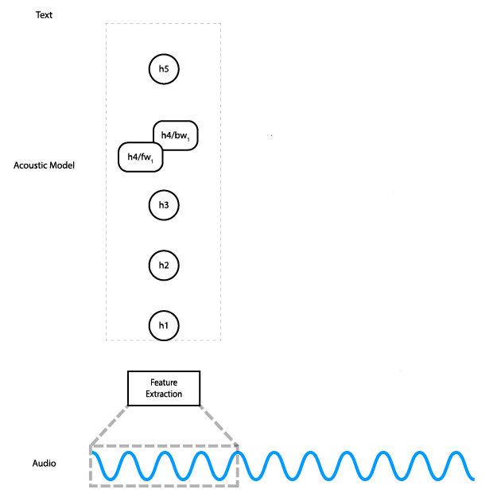

import { graphql } from 'gatsby';

We believe speech interfaces will be a big part of how people interact with their devices in the future. Today we are
excited to announce the initial release of our [open source speech recognition
model](https://github.com/coqui-ai/STT/releases/tag/v0.1.0) so that anyone can develop compelling speech experiences.

The Machine Learning team has been working on an open source Automatic Speech Recognition engine modeled after the Deep
Speech papers ([1](https://arxiv.org/abs/1412.5567), [2](https://arxiv.org/abs/1512.02595)) published by Baidu. One of
the major goals from the beginning was to achieve a Word Error Rate in the transcriptions of under 10%. We have made
great progress: Our word error rate on LibriSpeech’s test-clean set is 6.5%, which not only achieves our initial goal,
but gets us close to human level performance.

This post is an overview of the team’s efforts and ends with a more detailed explanation of the final piece of the
puzzle: the CTC decoder.

### The Architecture

Coqui STT is an end-to-end trainable, character-level, deep recurrent neural network
([RNN](https://en.wikipedia.org/wiki/Recurrent_neural_network)). In less buzzwordy terms: it’s a deep neural network
with recurrent layers that gets audio features as input and outputs characters directly — the transcription of the
audio. It can be trained using supervised learning from scratch, without any external “sources of intelligence”, like a
grapheme to phoneme converter or forced alignment on the input.

This animation shows how the data flows through the network. In practice, instead of processing slices of the audio
input individually, we do all slices at once.

The network has five layers: the input is fed into three fully connected layers, followed by a bidirectional RNN layer,
and finally a fully connected layer. The hidden fully connected layers use the
[ReLU](https://en.wikipedia.org/wiki/Rectifier_%28neural_networks%29) activation. The RNN layer uses LSTM cells with
tanh activation.

The output of the network is a matrix of character probabilities over time. In other words, for each time step the
network outputs one probability for each character in the alphabet, which represents the likelihood of that character
corresponding to what’s being said in the audio at that time. The [CTC loss
function](http://www.cs.toronto.edu/~graves/icml_2006.pdf) (PDF link) considers all alignments of the audio to the
transcription at the same time, allowing us to maximize the probability of the correct transcription being predicted
without worrying about alignment. Finally, we train using the [Adam optimizer](https://arxiv.org/abs/1412.6980).

### The Data

Supervised learning requires data, lots and lots of it. Training a model like Coqui STT requires thousands of hours of
labeled audio, and obtaining and preparing this data can be as much work, if not more, as implementing the network and
the training logic.

We started by downloading freely available speech corpora like
[TED-LIUM](http://www-lium.univ-lemans.fr/en/content/ted-lium-corpus) and [LibriSpeech](http://www.openslr.org/12/), as
well as acquiring paid corpora like [Fisher](https://catalog.ldc.upenn.edu/LDC2004S13) and
[Switchboard](https://catalog.ldc.upenn.edu/ldc97s62). We wrote importers in Python for the different data sets that
convert the audio files to WAV, split the audio and cleaned up the transcription of unneeded characters like punctuation
and accents. Finally we stored the preprocessed data in CSV files that can be used to feed data into the network.

Using existing speech corpora allowed us to quickly start working on the model. But in order to achieve excellent
results, we needed a lot more data. We had to be creative. We thought that maybe this type of speech data would already
exist out there, sitting in people’s archives, so we reached out to public TV and radio stations, language study
departments in universities, and basically anyone who might have labeled speech data to share. Through this effort, we
were able to more than double the amount of training data we had to work with, which is now enough for training a
high-quality English model.

Having a high-quality voice corpus publicly available not only helps advance our own speech recognition engine. It will
eventually allow for broad innovation because developers, startups and researchers around can train and experiment with
different architectures and models for different languages. It could help democratize access to deep learning for those
who can’t afford to pay for thousands of hours of training data (almost everyone).

To build a speech corpus that’s free, open source, and big enough to create meaningful products with, we worked with
Mozilla’s Open Innovation team and launched the [Common Voice project](https://commonvoice.mozilla.org/en) to collect
and validate speech contributions from volunteers all over the world. Today, the team is releasing a large collection of
voice data into the [public domain](https://creativecommons.org/choose/zero/). Find out more about the release on [the
Open Innovation Medium
blog](https://medium.com/mozilla-open-innovation/sharing-our-common-voice-mozilla-releases-second-largest-public-voice-data-set-e88f7d6b7666).

### The Hardware

Coqui STT has over 120 million parameters, and training a model this large is a very computationally expensive task: you
need lots of GPUs if you don’t want to wait forever for results. We looked into training on the cloud, but it doesn’t
work financially: dedicated hardware pays for itself quite quickly if you do a lot of training. The cloud is a good way
to do fast hyperparameter explorations though, so keep that in mind.

We started with a single machine running four Titan X Pascal GPUs, and then bought another two servers with 8 Titan XPs
each. We run the two 8 GPU machines as a cluster, and the older 4 GPU machine is left independent to run smaller
experiments and test code changes that require more compute power than our development machines have. This setup is
fairly efficient, and for our larger training runs we can go from zero to a good model in about a week.

Setting up distributed training with TensorFlow was an arduous process. Although it has the most mature distributed
training tools of the available deep learning frameworks, getting things to actually work without bugs and to take full
advantage of the extra compute power is tricky. Our current setup works thanks to the incredible efforts of my colleague
[Tilman Kamp](https://github.com/tilmankamp), who endured long battles with TensorFlow,
[Slurm](https://slurm.schedmd.com/), and even the Linux kernel until we had everything working.

### Putting it All Together

At this point, we have two papers to guide us, a model implemented based on those papers, the resulting data, and the
hardware required for the training process. It turns out that replicating the results of a paper isn’t that
straightforward. The vast majority of papers don’t specify all the hyperparameters they use, if they specify any at all.
This means you have to spend a whole lot of time and energy doing hyperparameter searches to find a good set of values.
Our initial tests with values chosen through a mix of randomness and intuition weren’t even close to the ones reported
by the paper, probably due to small differences in the architecture — for one, we used LSTM ([Long short-term
memory](https://en.wikipedia.org/wiki/Long_short-term_memory)) cells instead of GRU (gated recurrent unit) cells. We
spent a lot of time doing a binary search on dropout ratios, we reduced the learning rate, changed the way the weights
were initialized, and experimented with the size of the hidden layers as well. All of those changes got us pretty close
to our desired target of <10% Word Error Rate, but not there.

One piece missing from our code was an important optimization: integrating our language model into the decoder. The CTC
(Connectionist Temporal Classification) decoder works by taking the probability matrix that is output by the model and
walking over it looking for the most likely text sequence according to the probability matrix. If at time step 0 the
letter “C” is the most likely, and at time step 1 the letter “A” is the most likely, and at time step 2 the letter “T”
is the most likely, then the transcription given by the simplest possible decoder will be “CAT”. This strategy is called
greedy decoding.

This is a pretty good way of decoding the probabilities output by the model into a sequence of characters, but it has
one major flaw: it only takes into account the output of the network, which means it only takes into account the
information from audio. When the same audio has two equally likely transcriptions (think “new” vs “knew”, “pause” vs
“paws”), the model can only guess at which one is correct. This is far from optimal: if the first four words in a
sentence are “the cat has tiny”, we can be pretty sure that the fifth word will be “paws” rather than “pause”. Answering
those types of questions is the job of a language model, and if we could integrate a language model into the decoding
phase of our model, we could get way better results.

When we first tried to tackle this issue, we ran into a couple of blockers in TensorFlow: first, it doesn’t expose its
beam scoring functionality in the Python API (probably for performance reasons); and second, the log probabilities
output by the CTC loss function were (are?) [invalid](https://github.com/tensorflow/tensorflow/issues/6034).

We decided to work around the problem by building something like a spell checker instead: go through the transcription
and see if there are any small modifications we can make that increase the likelihood of that transcription being valid
English, according to the language model. This did a pretty good job of correcting small spelling mistakes in the
output, but as we got closer and closer to our target error rate, we realized that it wasn’t going to be enough. We’d
have to bite the bullet and write some C++.

### Beam Scoring with a Language Model

Integrating the language model into the decoder involves querying the language model every time we evaluate an addition
to the transcription. Going back to the previous example, when looking into whether we want to choose “paws” or “pause”
for the next word after “the cat has tiny”, we query the language model and use that score as a weight to sort the
candidate transcriptions. Now we get to use information not just from audio but also from our language model to decide
which transcription is more likely. The algorithm is described in [this paper](https://arxiv.org/abs/1408.2873) by
Hannun et. al.

Luckily, TensorFlow does have an extension point on its CTC beam search decoder that allows the user to supply their own
beam scorer. This means all you have to do is write the beam scorer that queries the language model and plug that in.
For our case, we wanted that functionality to be exposed to our Python code, so we also exposed it as a custom
TensorFlow operation that can be loaded using
[tf.load_op_library](https://www.tensorflow.org/api_docs/python/tf/load_op_library).

Getting all of this to work with our setup required quite a bit of effort, from fighting with the Bazel build system for
hours, to making sure all the code was able to handle Unicode input in a consistent way, and debugging the beam scorer
itself. The system requires quite a few pieces to work together:

- The language model itself (we use [KenLM](http://kheafield.com/code/kenlm/) for building and querying). A
- [trie](https://en.wikipedia.org/wiki/Trie) of all the words in our vocabulary. An alphabet file that maps integer
- labels output by the network into characters.

Although adding this many moving parts does make our code harder to modify and apply to different use cases (like other
languages), it brings great benefits: Our word error rate on LibriSpeech’s test-clean set went from 16% to 6.5%, which
not only achieves our initial goal, but gets us close to human level performance (5.83% according to the Deep Speech 2
paper). On a MacBook Pro, using the GPU, the model can do inference at a real-time factor of around 0.3x, and around
1.4x on the CPU alone. (A real-time factor of 1x means you can transcribe 1 second of audio in 1 second.)

It has been an incredible journey to get to this place: the initial release of our model! In the future we want to
release a model that’s fast enough to run on a mobile device or a Raspberry Pi.

If this type of work sounds interesting or useful to you, come check out our repository on GitHub and our Discourse
channel. We have a growing community of contributors and we’re excited to help you create and publish a model for your
language.

### License

[Creative Commons Attribution Share-Alike License v3.0](https://creativecommons.org/licenses/by-sa/3.0/) or any later
version

<!-- markdownlint-enable line-length -->

export const pageQuery = graphql`
  query($fileAbsolutePath: String) {
    ...SidebarPageFragment
  }
`;
