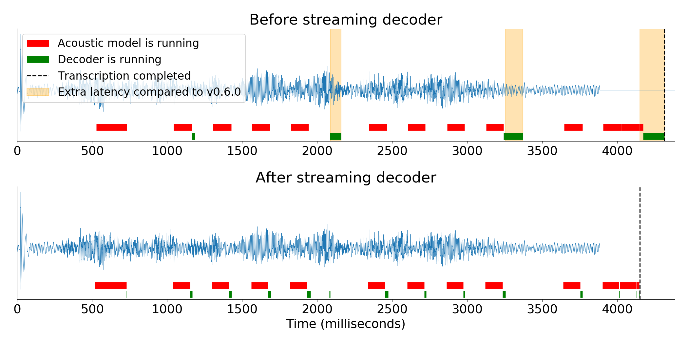
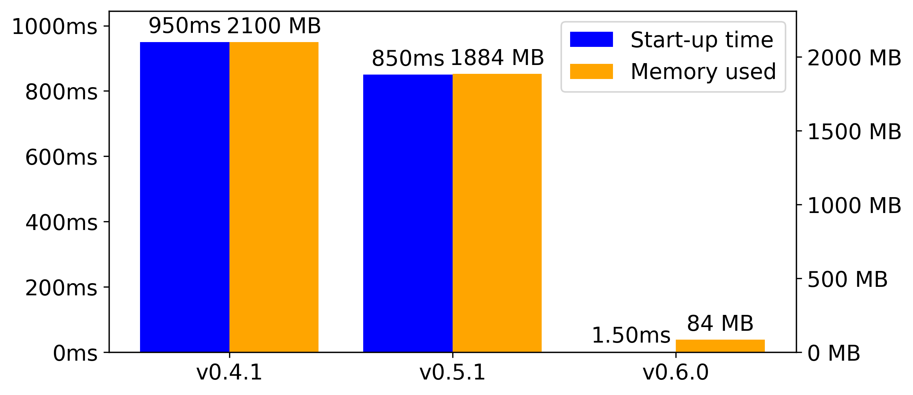
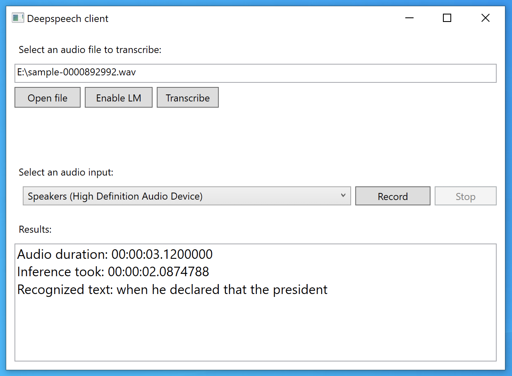

import { graphql } from 'gatsby';

The Machine Learning team continues work on Coqui STT, an automatic speech recognition (ASR) engine which aims to make
speech recognition technology and trained models openly available to developers. Coqui STT is a deep learning-based ASR
engine with a simple API. We also provide pre-trained English models.

Our latest release, version v0.6, offers the highest quality, most feature-packed model so far. In this overview, we’ll
show how Coqui STT can transform your applications by enabling client-side, low-latency, and privacy-preserving speech
recognition capabilities.

### Consistent low latency

Coqui STT v0.6 includes a host of performance optimizations, designed to make it easier for application developers to
use the engine without having to fine tune their systems. Our new streaming decoder offers the largest improvement,
which means Coqui STT now offers consistent low latency and memory utilization, regardless of the length of the audio
being transcribed. Application developers can obtain partial transcripts without worrying about big latency spikes.

Coqui STT is composed of two main subsystems: an acoustic model and a decoder. The acoustic model is a deep neural
network that receives audio features as inputs, and outputs character probabilities. The decoder uses a beam search
algorithm to transform the character probabilities into textual transcripts that are then returned by the system.

In a [previous blog post](/blog/stt/speech-recognition-deepspeech), I discussed how we made the acoustic model
streamable. With both systems now capable of streaming, there’s no longer any need for carefully tuned silence detection
algorithms in applications. [dabinat](https://github.com/dabinat), a long-term volunteer contributor to the Coqui STT
code base, contributed this feature. Thanks!

In the following diagram, you can see the same audio file being processed in real time by Coqui STT, before and after
the decoder optimizations. The program requests an intermediate transcription roughly every second while the audio is
being transcribed. The dotted black line marks when the program has received the final transcription. Then, the distance
from the end of the audio signal to the dotted line represents how long a user must wait after they’ve stopped speaking
until the final transcript is computed and the application is able to respond.

In this case, the latest version of Coqui STT provides the transcription 260ms after the end of the audio, which is 73%
faster than before the streaming decoder was implemented. This difference would be even larger for a longer recording.
The intermediate transcript requests at seconds 2 and 3 of the audio file are also returned in a fraction of the time.

Maintaining low latency is crucial for keeping users engaged and satisfied with your application. Coqui STT enables
low-latency speech recognition services regardless of network conditions, as it can run offline, on users’ devices.

### TensorFlow Lite, smaller models, faster start-up times

We have added support for [TensorFlow Lite](https://www.tensorflow.org/lite), a version of TensorFlow that’s optimized
for mobile and embedded devices. This has reduced the Coqui STT package size from 98 MB to 3.7 MB. It has reduced our
English model size from 188 MB to 47 MB. We did this via [post-training
quantization](https://www.tensorflow.org/lite/performance/post_training_quantization), a technique to compress model
weights after training is done. TensorFlow Lite is designed for mobile and embedded devices, but we found that for Coqui
STT it is even faster on desktop platforms. And so, we’ve made it available on Windows, macOS, and Linux as well as
Raspberry Pi and Android. **Coqui STT v0.6 with TensorFlow Lite runs faster than real time on a single core of a
Raspberry Pi 4.**

The following diagram compares the start-up time and peak memory utilization for Coqui STT versions v0.4.1, v0.5.1, and
our latest release, v0.6.0.

We now use **22 times less memory** and start up over **500 times faster**. Together with the optimizations we’ve
applied to our language model, a complete Coqui STT package including the inference code and a trained English model is
now more than **50% smaller**.

### Confidence value and timing metadata in the API

In addition, the new decoder exposes timing and confidence metadata, providing new possibilities for applications. We
now offer an extended set of functions in the API, not just the textual transcript. You also get metadata timing
information for each character in the transcript, and a per-sentence confidence value.

The example below shows the timing metadata extracted from Coqui STT from a sample audio file. The per-character timing
returned by the API is grouped into word timings. You can see the waveform below. Click the “Play” button to listen to
the sample.

<iframe
  width="100%"
  height="300"
  src="//jsfiddle.net/fwd9peL5/5/embedded/result/"
  allowfullscreen="allowfullscreen"
  allowpaymentrequest
  frameborder="0"
></iframe>

[Te Hiku Media](https://tehiku.nz/) are using Coqui STT to develop and deploy the first [Te reo
Māori](https://en.wikipedia.org/wiki/M%C4%81ori_language) automatic speech recognizer. They have been exploring the use
of the confidence metadata in our new decoder to build a digital pronunciation helper for Te reo Māori. Recently, they
received a $13 million NZD investment from New Zealand’s Strategic Science Investment Fund to build [Papa Reo, a
multilingual language platform](https://tehiku.nz/te-hiku-tech/papa-reo/). They are starting with New Zealand English
and Te reo Māori.

### Windows/.NET support

Coqui STT v0.6 now offers packages for Windows, with .NET, Python, JavaScript, and C bindings. Windows support was a
much-requested feature that was contributed by [Carlos Fonseca](https://github.com/carlfm01), who also wrote the .NET
bindings and examples. Thanks Carlos!

You can find more details about our Windows support by looking at [the WPF
example](https://github.com/coqui-ai/STT/tree/v0.6.0/examples/net_framework/DeepSpeechWPF) (pictured below). It uses the
.NET bindings to create a small UI around Coqui STT. Our .NET package is available in the [NuGet
Gallery](https://www.nuget.org/packages/STT). You can install it directly from Visual Studio.

You can see the WPF example that’s available in our repository. It contains code demonstrating transcription from an
audio file, and also from a microphone or other audio input device.

### Centralized documentation

We have centralized the documentation for all our language bindings in a single website,
[stt.readthedocs.io](https://stt.readthedocs.io/). You can find the documentation for C, Python, .NET, Java and
NodeJS/Electron packages. Given the variety of language bindings available, we wanted to make it easier to locate the
correct documentation for your platform.

### Improvements for training models

With the upgrade to TensorFlow 1.14, we now leverage the [CuDNN RNN
APIs](https://www.tensorflow.org/versions/r1.14/api_docs/python/tf/contrib/cudnn_rnn/CudnnLSTM) for our training code.
This change gives us around 2x faster training times, which means faster experimentation and better models.

Along with faster training, we now also support online feature augmentation, as described in Google’s [SpecAugment
paper](https://arxiv.org/abs/1904.08779). This feature was contributed by [Iara Health](https://iarahealth.com/), a
Brazilian startup providing transcription services for health professionals. Iara Health has used online augmentation to
improve their production Coqui STT models.

  {' '}
  <iframe
    width="560"
    height="315"
    src="https://www.youtube.com/embed/uNqARK7euXk"
    frameborder="0"
    allow="accelerometer; autoplay; encrypted-media; gyroscope; picture-in-picture"
    allowfullscreen
  ></iframe>{' '}

The video above shows a customer using the Iara Health system. By using voice commands and dictation, the user instructs
the program to load a template. Then, while looking at results of an MRI scan, they dictate their findings. The user can
complete the report without typing. Iara Health has trained their own Brazilian Portuguese models for this specialized
use case.

### Try out Coqui STT v0.6

The [Coqui STT v0.6 release](https://github.com/coqui-ai/STT/releases/v0.6.0) includes our speech recognition engine as
well as a trained English model. We provide binaries for six platforms and, as mentioned above, have bindings to various
programming languages, including Python, JavaScript, Go, Java, and .NET.

The included English model was trained on 3816 hours of transcribed audio coming from [Common Voice
English](https://voice.mozilla.org/en/datasets), [LibriSpeech](http://www.openslr.org/12),
[Fisher](https://www.ldc.upenn.edu/sites/www.ldc.upenn.edu/files/lrec2004-fisher-corpus.pdf),
[Switchboard](https://catalog.ldc.upenn.edu/LDC97S62). The model also includes around 1700 hours of transcribed WAMU
(NPR) radio shows. It achieves a 7.5% word error rate on the LibriSpeech test clean benchmark, and is faster than real
time on a single core of a Raspberry Pi 4.

Coqui STT v0.6 includes our best English model yet. However, most of the data used to train it is American English. For
this reason, it doesn’t perform as well as it could on other English dialects and accents. A lack of publicly available
voice data in other languages and dialects is part of why [Common Voice](https://voice.mozilla.org/) was created. We
want to build a future where a speaker of Welsh or Basque or Scottish English has access to speech technology with the
same standard of quality as is currently available for speakers of languages with big markets like American English,
German, or Mandarin.

Want to participate in Common Voice? You can donate your voice by reading small text fragments. Or validate existing
recordings in 40 different languages, with more to come. Currently, Common Voice represents the world’s largest public
domain transcribed [voice dataset](https://voice.mozilla.org/en/datasets). The dataset consists of nearly 2,400 hours of
voice data with 29 languages represented, including English, French, German, Spanish and Mandarin Chinese, but also for
example Welsh and Kabyle.

The v0.6 release is now available on [GitHub](https://github.com/coqui-ai/STT/releases/v0.6.0) as well as on your
favorite package manager. You can download our pre-trained model and start using Coqui STT in minutes. If you’d like to
know more, you can find detailed release notes in the [GitHub release](https://github.com/coqui-ai/STT/releases/v0.6.0);
installation and usage explanations in our [README](https://github.com/coqui-ai/STT/blob/v0.6.0/README.rst). If that
doesn’t cover what you’re looking for, you can also use our [discussion
forum](https://github.com/coqui-ai/STT/discussions).

### License

[Creative Commons Attribution Share-Alike License v3.0](https://creativecommons.org/licenses/by-sa/3.0/) or any later
version

export const pageQuery = graphql`
  query($fileAbsolutePath: String) {
    ...SidebarPageFragment
  }
`;
