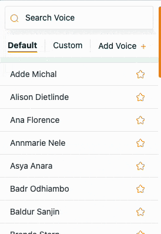
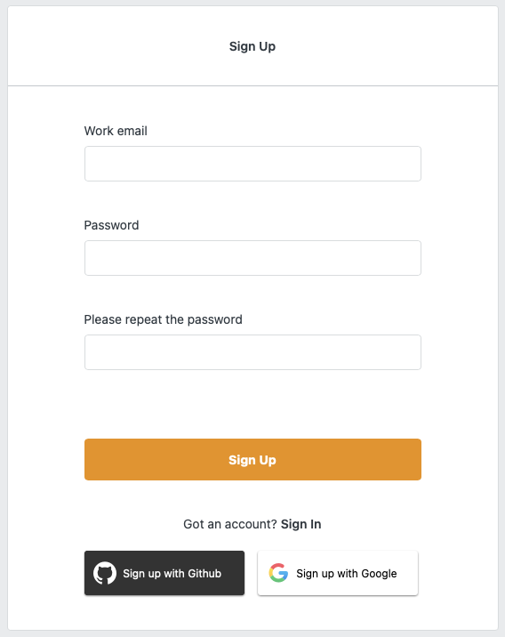
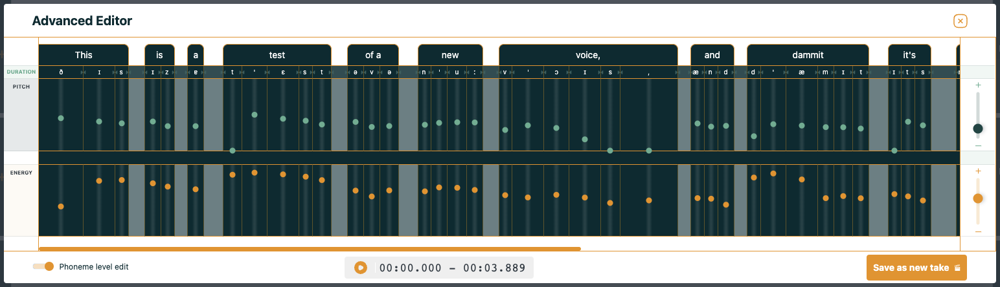

import { graphql } from 'gatsby';

👉 [Try Coqui Studio Now for Free!](https://app.coqui.ai/auth/signup)

### Introduction

Coqui Studio has always been at the forefront of cutting-edge generative AI voices. With advanced tools an intuitive
platform, Coqui Studio has helped creative professionals in various
industries achieve their goals with ease. Today, we're thrilled to announce the latest release of Coqui Studio,
packed with exciting new features and enhancements to take your experience to the next level!

### Voice Fusion

What if you could take two of your favorite voices and generate a new voice that combines their best qualities?
With the new voice fusion feature, you can! This exciting new tool allows you to fuse two different speakers and
generate a new speaker with a unique tone, pitch, and style. You can use this feature to age voices, change
their tone, or combine two of your favorite voices in any way you like. This opens up a whole new world of
possibilities for voice casting and character development.

  <iframe
    style="width:408px; height:520px;
           border-width: 0px 1px 1px 1px;
           border-style: solid solid solid solid;
           border-color: black black black black;"
    src="https://youtube.com/embed/6qlrJbpG9LE"
    allow="accelerometer;
        autoplay; encrypted-media; gyroscope; picture-in-picture"
    allowfullscreen
  ></iframe>

### New Built-in Speakers

We've added a brand new set of **over 30** built-in speakers to our platform, giving you even more options.
Whether you're looking for a confident, authoritative voice, or a bold, charismatic one, our new built-in
speakers are sure to deliver. With more voices being added with every release, Coqui Studio is your
one-stop-shop for generative
AI voices.

### Social Login with Google or GitHub

Coqui Studio now supports social login with your Google or GitHub account, making it easier than ever to get
started with our platform. Simply log in with your Google or GitHub account, and you'll be up and running in
no time. This is a huge time-saver for those who already have a Google or GitHub account and don't want to
create a new one just to use our
platform.

### An Even Faster Advanced Editor

Our advanced editor just got even faster with this latest release. (‘bet you didn’t even think that was possible.)
We've tuned the advanced editor to make your directorial experience even faster and smoother. With snappier
reaction times, the duration, pitch, and volume sliders allow you to take full control of your generative AI
voices with ease. Also, you can now change the pitch and/or volume an entire line, a welcome feature.

### Better Voice Cloning Model

Cloning voices has never been easier with Coqui Studio. With this latest release, we've improved our already awesome
voice cloning model to deliver even higher quality clones but with only 3 seconds of audio. That's right, with just
3 seconds of audio, you can now clone any voice you like and start directing immediately. This is a game-changer
for creative professionals who need to find just the right voice, yesterday.

### Conclusion

We're super confident that this latest release of Coqui Studio will be a game-changer for creative professionals who
need a reliable and efficient platform for voice. With its cutting-edge technology and intuitive UI, Coqui Studio is
the perfect tool for anyone looking to take their experience to the next level. So, why wait? Try Coqui Studio now
and get 30 minutes of free synthesis time, no credit card required!

export const pageQuery = graphql`
  query($fileAbsolutePath: String) {
    ...SidebarPageFragment
  }
`;
