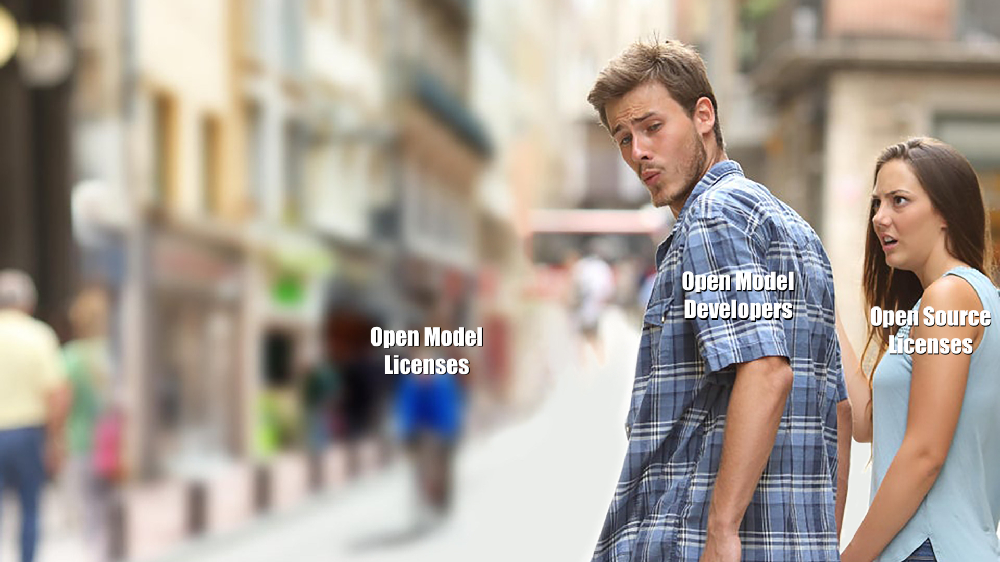

import { graphql } from 'gatsby';

### Introduction

Currently, open _model_ licensing is broken… very broken.

To help fix this, Coqui is releasing the Coqui Public Model License (CPML), an open
_model_ license created through a collaboration with [Heather Meeker](https://www.linkedin.com/in/heathermeeker/),
a world-leading expert on open source licenses.

At Coqui, it’s our sincere hope that the Coqui Public Model License (CPML) will not
only serve our needs but will be of use to the greater machine learning community.

### Model Licensing is Broken

Calling the current state of affairs "broken" is an understatement. Can something be
broken if it doesn’t exist? (A philosophical question that we don’t even know how to
begin to answer.)

However, what we _do_ know is that a majority of open _models_ use open _source_
licenses. BERT is under Apache 2.0, GPT-2 is under MIT, Whisper is MIT, and on and on.
Naively this makes some sense. If you squint, a model and source code are both just
strings of bits. So, why not use an open source license for a model?

This naive view is, however, unfortunately missguided. Models and source code are _very_
different things, and a source code license doesn’t necessarily apply to a model. To
see this you just need to look at likely the most straightforward license there is,
the MIT license. It begins…

> _Permission is hereby granted, free of charge, to any person obtaining a copy of this
> software and associated documentation files (the “Software”), to deal in the Software
> without restriction…_

Applying this license to a model, say GPT-2, the first question one would run into would
be: _Is a model software?_ A little “think” would lead one to the very next question:
_Well, what is software?_

Thomson Reuters Practical Law defines [software](https://uk.practicallaw.thomsonreuters.com/w-018-5815)
as:

> _A computer program or set of instructions that controls the operation of a computer or
> similar electronic device, including in the form of object code (machine readable) or
> source code (human readable)._

It’s clear that the GPT-2 model isn’t software in this sense. The raw GPT-2 model, without a
program that uses it, clearly isn’t “a computer program or set of instructions that controls
the operation of a computer or similar electronic device”. In particular the GPT-2 model
isn’t object code or source code.

So, what does releasing GPT-2 under the MIT license mean legally? The jury is still out on
that one.

### Coqui Public Model License (CPML)

This, and even worse headache inducing problems encountered in trying to apply an existing
open source license to a model, led us to the conclusion that we needed to create a new
model license whole cloth. There really was no other choice.

The new license we created, the Coqui Public Model License (CPML), will be something we
will use going forward and something we hope the broader machine learning community can
adopt too.

Generally, we’ve constructed the Coqui Public Model License (CPML) to be an open model
license, that allows for non-commercial use of the model, non-commercial use of the
model outputs, and allows for use of the model and model outputs by charitable organizations
and the like.

For all the license details you can refer to the text of the [Coqui Public Model License (CPML)](/cpml).
To check out the first time the Coqui Public Model License (CPML) was used for a model, you
can read [XTTS: Open Source Release Announcement](/blog/tts/open_xtts).

export const pageQuery = graphql`
  query($fileAbsolutePath: String) {
    ...SidebarPageFragment
  }
`;
