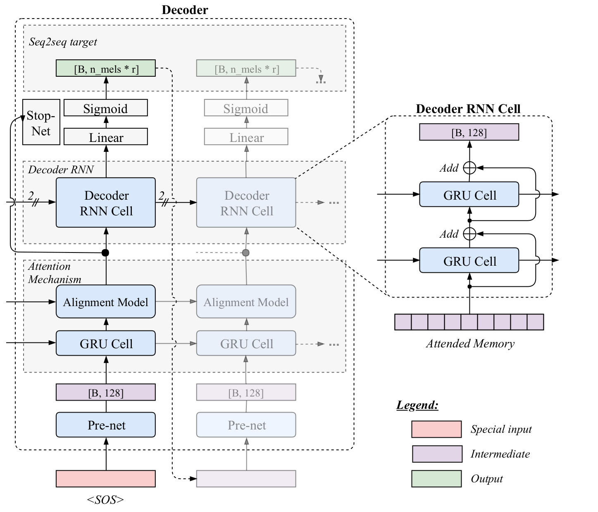
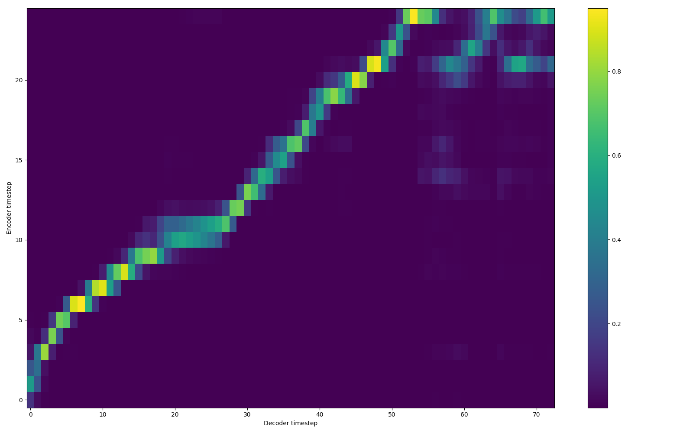
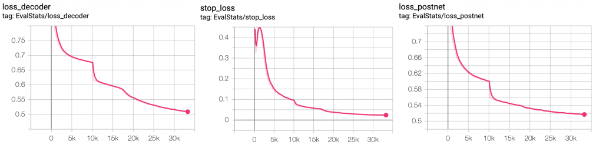

import { graphql } from 'gatsby';

Tacotron is a commonly used Text-to-Speech architecture. It is a very flexible
alternative over traditional solutions. It only requires text and corresponding
voice clips to train the model. It avoids the toil of fine-grained annotation
of the data. However, Tacotron might also be very time demanding to train,
especially if you don’t know the right hyperparameters to begin with. Here, I
like to share a gradual training scheme to ease the training difficulty. In my
experiments, it provides faster training, tolerance for various hyperparameter
values, and more time with your family.

In summary, Tacotron is an Encoder-Decoder architecture with Attention. it
takes a sentence as a sequence of characters (or phonemes) and it outputs
sequence of spectrogram frames to be ultimately converted to speech with an
additional vocoder algorithm (e.g. Griffin-Lim or WaveRNN). There are two
versions of Tacotron, Tacotron and Tacotron2. Tacotron is a complicated
architecture but it has fewer model parameters as compared to Tacotron2.
Tacotron2 is much simpler but it is about 4x larger (7m vs 24m parameters). To
be clear, so far I have only used this gradual training method with Tacotron
and I am about to begin to experiment with Tacotron2 soon.



Here is the trick. Tacotron has a parameter called "r" which defines the number
of spectrogram frames predicted per decoder iteration. It is a useful parameter
to reduce the number of computations since the larger r, the fewer the decoder
iterations. But setting the value to high might reduce the performance as well.
Another benefit of higher r value is that the alignment module stabilizes much
faster. If you talk someone who used Tacotron, they would probably know what
struggle the attention means. So finding the right trade-off for r is a great
deal. In the original Tacotron paper, authors used r as 2 for the best-reported
model. They also emphasize the challenge of training the model with r=1.

Gradual training comes to the rescue at this point. What it means is that we
set r initially large, such as 7. Then, as the training continues, we reduce it
until the convergence. This simple trick helps quite magically to solve two
main problems. The first, it helps the network to learn the monotonic attention
after almost the first epoch. The second, it expedites convergence quite much.
As a result, the final model happens to have more stable and resilient
attention without any degrigation of performance. You can even eventually let
the network to train with r=1 which was not even reported in the original
paper.

Here, I like to share some results to prove the effectiveness. I used LJspeech
dataset for all the results. The training schedule can be summarized as
follows. (You see I also change the batch_size but it is not necessary if you
have enough GPU memory.)

```python
{
“gradual_training”: [[0, 7, 32], [10000, 5, 32], [50000, 3, 32], [130000, 2, 16], [290000, 1, 8]] # [start_step, r, batch_size]
}
```

Below you can see the attention at validation time after just 1K iterations
with the training schedule above.



Next, let’s check the model training curve and convergence.



Here you can see here the model jumping from r=7 to r=5 at about 10k
iterations. There is obvious easy gain after the jump.

You can listen to [voice
examples](https://soundcloud.com/user-565970875/sets/gradual-training-results)
generated with the final model using GriffinLim vocoder. I’d say the quality of
these examples is quite good to my ear.

This is a short post, but if you like to replicate the results here, you can
visit our repo [TTS](https://github.com/coqui-ai/TTS) and just run the training
with the provided config.json file. Hopefully, the documentation on the repo
would help you in getting started. Otherwise, you can always ask for help
creating an issue or on our [TTS discussion
page](https://github.com/coqui-ai/TTS/discussions). There are also some other
cool things in the repo that I will also write about in the future. Until next
time!

export const pageQuery = graphql`
  query($fileAbsolutePath: String) {
    ...SidebarPageFragment
  }
`;
