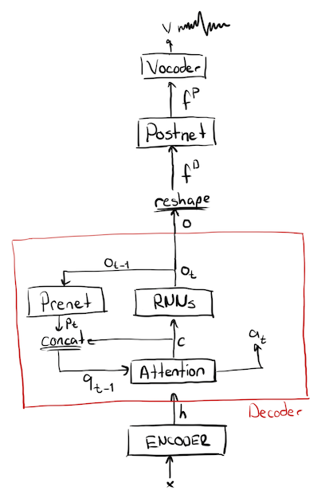
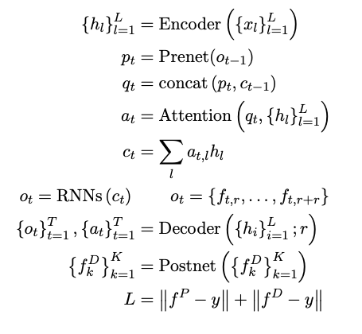
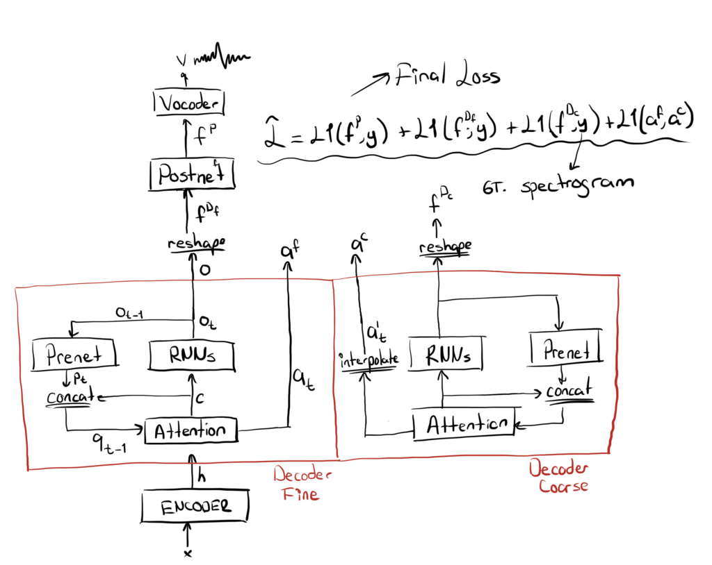
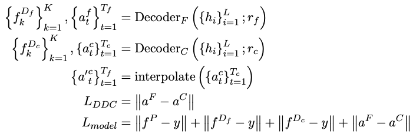
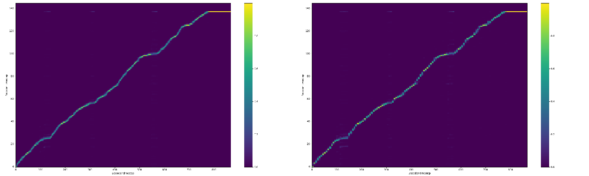
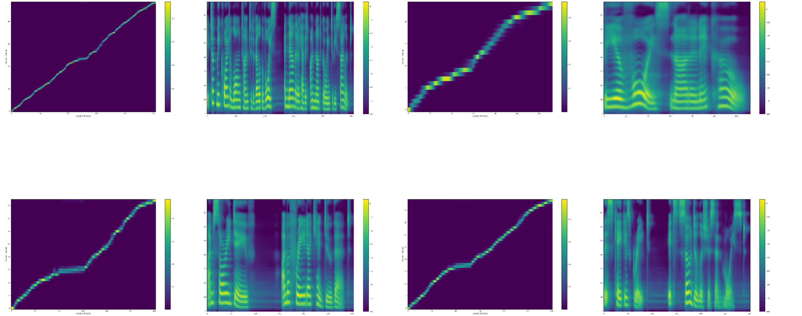

import { graphql } from 'gatsby';

Despite the success of the latest attention based end2end text2speech (TTS)
models, they suffer from attention alignment problems at inference time. They
occur especially with long-text inputs or out-of-domain character sequences.
Here I'd like to propose a novel technique to fight against these alignment
problems which I call Double Decoder Consistency (DDC) (with a limited
creativity). DDC consists of two decoders that learn synchronously with
different reduction factors. We use the level of consistency of these decoders
to attain better attention performance.

<div align="center">
  <iframe
    width="560"
    height="315"
    src="https://www.youtube.com/embed/ADnBCz0Wd1U"
    frameborder="0"
    allow="accelerometer;
        autoplay; encrypted-media; gyroscope; picture-in-picture"
    allowfullscreen
  ></iframe>
</div>

### End-to-End TTS Models with Attention

Good examples of attention based TTS models are Tacotron and Tacotron2
[[1](https://arxiv.org/abs/1703.10135)][[2](http://arxiv.org/abs/1712.05884)].
Tacotron2 is also the main architecture used in this work. These models
comprise a sequence-to-sequence architecture with an encoder, an
attention-module, a decoder and an additional stack of layers called Postnet.
The encoder takes an input text and computes a hidden representation from which
the decoder computes predictions of the target acoustic feature frames. A
context-based attention mechanism is used to align the input text with the
predictions. Finally, decoder predictions are passed over the Postnet which
predicts residual information to improve the reconstruction performance of the
model. In general, mel-spectrograms are used as acoustic features to represent
audio signals in a lower temporal resolution and perceptually meaningful way.

Tacotron proposes to compute multiple non-overlapping output frames by the
decoder. You are able to set the number of output frames per decoder step which
is called "reduction rate" (r). Larger the reduction rate, fewer the number of
decoder steps required for the model to produce the same length output.
Thereby, the model achieves faster training convergence and easier attention
alignment, as explained in [[1](https://arxiv.org/abs/1703.10135)]. However,
larger r values also produce smoother output frames and therefore, reduce the
frame-level details.

Although these models are used in TTS systems for more natural-sounding speech,
they frequently suffer from attention alignment problems, especially at
inference time, because of out-of-domain words, long input texts, or
intricacies of the target language. One solution is to use larger r for a
better alignment however, as noted above, it reduces the quality of the
predicted frames. DDC tries to mitigate these attention problems by introducing
a new architecture.

<div align="center">



</div>

The bare-bone model used in this work is formalized as follows:

<div align="center">



</div>

where y<sub>k</sub> is a sequence of acoustic feature frames. x<sub>l</sub> is
a sequence of characters or phonemes, from which we compute sequence of encoder
outputs h<sub>l</sub>. r is the reduction factor which defines the number of
output frames per decoder step. Attention alignments, query vector and encoder
output at decoder step t are donated by a<sub>t</sub>, q<sub>t</sub>, and
o<sub>t</sub> respectively. Also, o<sub>t</sub> defines a set of output frames
whose size changed by r. Total number of decoder steps is donated by T.

Note that teacher forcing is applied at training. Therefore, K=Tr at training
time. However, the decoder is instructed to stop at inference by a separate
network (Stopnet) which predicts a value in a range [0, 1]. If its prediction
is larger than a defined threshold, the decoder stops inference.

### Double Decoder Consistency

DDC is based on two decoders working simultaneously with different reduction
factors (r). One decoder (coarse) works with a large, and the other decoder
(fine) works with a small reduction factor.

DDC is designed to settle the trade-off between the attention alignment and the
predicted frame quality tunned by the reduction factor. In general, standard
models have more robust attention performance with a larger r but due to the
smoothing effect of multiple-frames prediction per iteration, final acoustic
features are coarser compared to lower reduction factor models.

DDC combines these two properties at training time as it uses the coarse
decoder to guide the fine decoder to preserve the attention performance without
a loss of precision in acoustic features. DDC achieves this by introducing an
additional loss function comparing the attention vectors of these two decoders.

For each training step, both decoders compute their relative attention vectors
and the outputs. Due to the differences in their respective r values, their
attention vectors are different lengths. The coarse decoder produces a shorter
vector compared to the fine decoder. In order to mitigate this, we interpolate
the coarse attention vector to match the length of the fine attention vector.
After coercing them in the same length we use a loss function to penalize the
difference in the alignments. This loss is able to synchronize two decoders
with respect to their alignments.



The two decoders take the same input from the encoder. They also compute the
outputs in the same way except they use different reduction factors. The coarse
decoder uses a larger reduction factor compared to the fine decoder. These two
decoders are trained with separate loss functions comparing their respective
outputs with the real feature frames. The only interaction between these two
decoders is the attention loss applied to compare their respective attention
alignments.

<div align="center">



</div>

### Other Model Update

#### Batch Norm Prenet

The Prenet is an important part of Tacotron-like auto-regressive models. It
projects model output frames before passing to the decoder. Essentially, it
computes an embedding space of the feature (spectrogram) frames by which the
model de-factors the distribution of upcoming frames.

I replaced the original Prenet (PrenetDropout) with the one using Batch
Normalization [[3](https://arxiv.org/abs/1502.03167)] (PrenetBN) after each
dense layer, and I removed the Dropout layers. Dropout is necessary for
learning attention, especially when the data quality is low. However, it causes
problems at inference due to distributional differences between training and
inference time. Using Batch Normalization is a good alternative. It avoids the
issues of Dropout and also provides a certain level of regularization due to
the noise of batch-level statistics. It also normalizes computed embedding
vectors and generates a well-shaped embedding space.

#### Gradual Training

I used a gradual training scheme for the model training. I’ve introduced
gradual training in a previous <Link
to='/blog/tts/gradual-training-with-tacotron-for-faster-convergence'>blog
post</Link>. In short, we start the model training with a larger reduction
factor and gradually reduce it as the model saturates.

Gradual Training shortens the total training time significantly and yields
better attention performance due to its progression from coarse to fine
information levels.

#### Recurrent PostNet at Inference

The Postnet is the part of the network applied after the Decoder to improve the
Decoder predictions before the vocoder. Its output is summed with the Decoder’s
to form the final output of the model. Therefore, it predicts a residual which
improves the Decoder output. So we can also apply Postnet more than one time,
assuming it computes useful residual information each time. I applied this
trick only at inference and observe that, up to a certain number of iterations,
it improves the performance. For my experiments, I set the number of iterations
to 2.

#### MB-Melgan Vocoder with Multiple Random Window Discriminator

As a vocoder, I use Multi-Band Melgan [[11](http://arxiv.org/abs/2005.05106)]
generator. It is trained with Multiple Random Window Discriminator
(RWD)[[13](http://arxiv.org/abs/1909.11646)] which is different than in the
original work [[11](http://arxiv.org/abs/2005.05106)] where they used
Multi-Scale Melgan Discriminator (MSMD)[[12](http://arxiv.org/abs/1909.11646)].

The main difference between these two is that RWD uses audio level information
and MSMD uses spectrogram level information. More specifically, RWD comprises
multiple convolutional networks each takes different length audio segments with
different sampling rates and performs classification whereas MSMD uses
convolutional networks to perform the same classification on STFT output of the
target voice signal.

In my experiments, I observed RWD yields better results with more natural and
less abberated voice.

### Related Work

Guided attention [[4](http://arxiv.org/abs/1710.08969)] uses a soft diagonal
mask to force the attention alignment to be diagonal. As we do, it uses this
constant mask at training time to penalize the model with an additional loss
term. However, due to its constant nature, it dictates a constant prior to the
model which does not always to be true, especially long sentences with various
pauses. It also causes skipping in my experiments which are tried to be solved
by using a windowing approach at inference time in their work.

Using multiple decoders is initially introduced by
[[5](http://arxiv.org/abs/1907.09006)]. They use two decoders that run in
forward and backward directions through the encoder output. The main problem
with this approach is that because of the use of two decoders with identical
reduction factors, it is almost 2 times slower to train compared to a vanilla
model. We solve the problem by using the second decoder with a higher reduction
rate. It accelerates the training significantly and also gives the user the
opportunity to choose between the two decoders depending on run-time
requirements. DDC also does not use any complex scheduling or multiple loss
signals that aggravates the model training.

Lately, new TTS models introduced by
[[7](http://arxiv.org/abs/1905.0926)][[8](http://arxiv.org/abs/2005.11129)][[9](http://arxiv.org/abs/2006.04558)][[10](https://doi.org/10.1109/icassp40776.2020.9054484)]
predict output duration directly from the input characters. These models train
a duration-predictor or use approximation algorithms to find the duration of
each input character. However, as you listen to their samples, one can observe
that these models lead to degraded timbre and naturalness. This is because of
the indirect hard alignment produced by these models. However, models with
soft-attention modules can adaptively emphasize different parts of the speech
producing a more natural speech.

### Results and Experiments

#### Experiment Setup

All the experiments are performed using LJspeech dataset
[[6](https://keithito.com/LJ-Speech-Dataset/)] . I use a sampling-rate of 22050
Hz and mel-scale spectrograms as the acoustic features. Mel-spectrograms are
computed with hop-length 256, window-length 1024. Mel-spectrograms are
normalized into [-4, 4]. You can see the used audio parameters below in our TTS
config format.

```js
// AUDIO PARAMETERS
    "audio":{
        // stft parameters
        "num_freq": 513,         // number of stft frequency levels. Size of the linear spectogram frame.
        "win_length": 1024,      // stft window length in ms.
        "hop_length": 256,       // stft window hop-lengh in ms.
        "frame_length_ms": null, // stft window length in ms.If null, 'win_length' is used.
        "frame_shift_ms": null,  // stft window hop-lengh in ms. If null, 'hop_length' is used.

        // Audio processing parameters
        "sample_rate": 22050,   // DATASET-RELATED: wav sample-rate. If different than the original data,
                                //   it is resampled.
        "preemphasis": 0.0,     // pre-emphasis to reduce spec noise and make it more structured.
                                //  If 0.0, no -pre-emphasis.
        "ref_level_db": 20,     // reference level db, theoretically 20db is the sound of air.

        // Silence trimming
        "do_trim_silence": true,// enable trimming of slience of audio as you load it. LJspeech (false),
                                //  TWEB (false), Nancy (true)
        "trim_db": 60,          // threshold for timming silence. Set this according to your dataset.

        // MelSpectrogram parameters
        "num_mels": 80,         // size of the mel spec frame.
        "mel_fmin": 0.0,        // minimum freq level for mel-spec. ~50 for male and ~95 for female voices.
                                //   Tune for dataset!!
        "mel_fmax": 8000.0,     // maximum freq level for mel-spec. Tune for dataset!!

        // Normalization parameters
        "signal_norm": true,    // normalize spec values. Mean-Var normalization if 'stats_path' is defined otherwise
                                //   range normalization defined by the other params.
        "min_level_db": -100,   // lower bound for normalization
        "symmetric_norm": true, // move normalization to range [-1, 1]
        "max_norm": 4.0,        // scale normalization to range [-max_norm, max_norm] or [0, max_norm]
        "clip_norm": true,      // clip normalized values into the range.
    },
```

I used Tacotron2[[2](http://arxiv.org/abs/1712.05884)] as the base architecture
with location-sensitive attention and applied all the model updates expressed
above. The model is trained for 330k iterations and it took 5 days with a
single GPU although the model seems to produce satisfying quality after only 2
days of training with DDC. I used a gradual training schedule shown below. The
model starts with r=7 and batch-size 64 and gradually reduces to r=1 and
batch-size 32. The coarse decoder is set r=7 for the whole training.

```js
{
"gradual_training": [[0, 7, 64], [1, 5, 64], [50000, 3, 32], [130000, 2, 32], [290000, 1, 32]], // [first_step, r, batch_size]
}
```

I trained MB-Melgan vocoder using real spectrograms up to 1.5M steps, which
took 10 days on a single GPU machine. For the first 600K iterations, it is
pre-trained with only the supervised loss as in
[[11](http://arxiv.org/abs/2005.05106)] and than the discriminator is enabled
for the rest of the training. I do not apply any learning rate schedule and I
used 1e-4 for the whole training.

#### DDC Attention Performance

The image below shows the validation alignments of the fine and the coarse
decoders which have r=1 and r=7 respectively. We observe that two decoders show
almost identical attention alignments with a slight roughness with the coarse
decoder due to the interpolation.

DDC significantly shortens the time required to learn the attention alignmet.
In my experiments, the model is able to align just after 1k steps as opposed to
~8k steps with normal location-sensitive attention.



At inference time, we ignore the coarse decoder and use only the fine decoder.
The image below depicts the model outputs and attention alignments at inference
time with 4 different sentences that are not seen at training time. This shows
us that the fine decoder is able to generalize successfully on novel sentences.



I used 50 hard-sentences introduced by [[7](http://arxiv.org/abs/1905.09263)]
to check the attention quality of the DDC model. As you see in the
[notebook](https://colab.research.google.com/gist/erogol/32d22e21eaa1d0cc0cb52f0fd0c72c55/ddc_sentece_test_330k.ipynb)
(Open it on Colab to listen to Griffin-Lim based voice samples), the DDC model
performs without any alignment problems. It is the first model, to my
knowledge, which performs flawlessly on these sentences.

#### Recurrent Postnet

In the image below we see the average L1 difference between the real
mel-spectrogram and the model prediction for each Postnet iteration. The
results improve until the 3rd iteration. We also observe that some of the
artifacts after the first iteration are removed by the second iteration that
yields a better L1 value. Therefore, we see here how effective the iterative
application of the Posnet to improve the final model predictions.


### Future Work

First of all I hope this section would not be “here are the things we’ve not
tried and will not try” section.

However, there are specifically three aspects of DDC which I like to
investigate more. The first is sharing the weights between the fine and the
coarse decoders to reduce the total number of model parameters and observing
how the shared weights benefit from different resolutions.

The second is to measure the level of complexity required by the coarse
decoder. That is, how much simpler the coarse architecture can get without
performance loss.

Finally, I like to try DDC with the different model architectures.

### Conclusion

Here I tried to summarize a new method that significantly accelerates model
training, provides steadfast attention alignment and provides a choice in a
spectrum of quality and speed switching between the fine and the coarse
decoders at inference. The user can choose depending on run-time requirements.

You can replicate all this work using our
[TTS](https://github.com/coqui-ai/TTS). You can also see voice samples and
Colab Notebooks from the links above. Let me know how it goes if you try DDC in
your project.

If you would like to cite this work, please use:

_Gölge E. (2020) Solving Attention Problems of TTS models with Double Decoder Consistency.
erogol.com/solving-attention-problems-of-tts-models-with-double-decoder-consistency/_

export const pageQuery = graphql`
  query($fileAbsolutePath: String) {
    ...SidebarPageFragment
  }
`;
