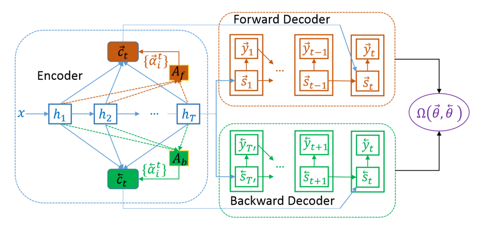
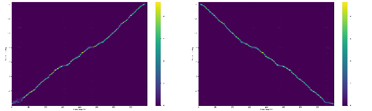
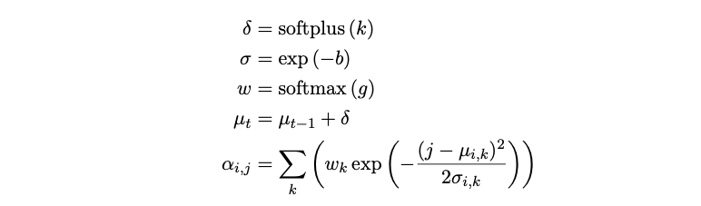
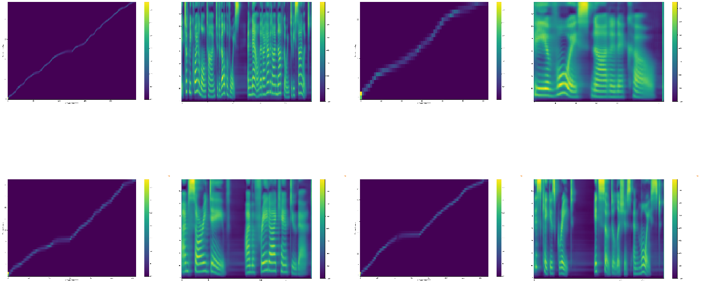

import { graphql } from 'gatsby';

In this post, I'd like to introduce two methods that, in my experience, worked
well for better attention alignment in Tacotron models. If you like to try your
own, you can visit [Coqui TTS](https://github.com/coqui-ai/TTS). The first
method is [Bidirectional Decoder](https://arxiv.org/abs/1907.09006) and the
second is [Graves Attention](https://arxiv.org/abs/1308.0850) (Gaussian
Attention) with small tweaks.

### Bidirectional Decoder

Bidirectional decoding uses an extra decoder which takes the encoder outputs in
the reverse order and then, there is an extra loss function that compares the
output states of the forward decoder with the backward one. With this
additional loss, the forward decoder models what it needs to expect for the
next iterations. In this regard, the backward decoder punishes bad decisions of
the forward decoder and vice versa.

Intuitively, if the forward decoder fails to align the attention, that would
cause a big loss and ultimately it would learn to go monotonically through the
alignment process with a correction induced by the backward decoder. Therefore,
this method is able to prevent “catastrophic failure” where the attention falls
apart in the middle of a sentence and it never aligns again.

At the inference time, the paper suggests to only use the forward decoder and
demote the backward decoder. However, it is possible to think more elaborate
ways to combine these two models.

There are 2 main pitfalls of this method. The first, due to additional
parameters of the backward decoder, it is slower to train this model (almost
2x) and this makes a huge difference especially when the reduction rate is low
(number of frames the model generates per iteration). The second, if the
backward decoder penalizes the forward one too harshly, that causes overall
prosody degradation. Due to this the paper suggests activating the additional
loss just for fine-tuning.

My experience is that Bidirectional training is quite robust against alignment
problems and it is especially useful if your dataset is hard. It also almost
aligns after the first epoch. Yes, at inference time, it sometimes causes
pronunciation problems but I solved this by doing the opposite of the paper’s
suggestion. Just for an epoch I finetuned the network without the additional
loss and everything started to work well.

### Graves Attention

Tacotron uses Bahdenau Attention which is a content-based attention method. It
does not consider location information. Therefore, it needs to learn the
monotonicity of the alignment just looking into the content which is a hard
problem. Tacotron2 uses Location Sensitive Attention which takes into account
the previous attention weights. By doing so, it learns the monotonic
constraint. But it does not solve all of the problems and you can still
experience failures with long or out of domain sentences.

Graves Attention is an alternative that uses content information to decide how
far it needs to go on the alignment per iteration. It does this by using a
mixture of Gaussian distributions.

Graves Attention takes the context vector of time t-1 and passes it through
couple of fully connected layers ([FC > ReLU > FC] in our model) and estimates
step-size, variance and distribution weights for time t. Then the estimated
step-size is used to update the mean of Gaussian modes. Analogously, mean is
the point of interest t the alignment path, variance is attention window over
this point of interest and distribution weight is the importance of each
distribution head.

Formulated as I compute the alignment in my implementation. Here g, b, and k
are intermediate values, 𝛿 is the step size, σ is the variance, and
wk is the distribution weight for the GMM node k.

Some other versions are explained [here](https://arxiv.org/abs/1910.10288) but
so far I found the above formulation works for me the best, without any NaNs in
training. I also realized that with the best-claimed method in this paper, one
of the distribution nodes overruns the others in the middle of the training and
basically, attention starts to run on a single Gaussian head.

The benefit of using GMM is to have more robust attention. It is also
computationally light-weight compared to both bidirectional decoding and normal
location attention. Therefore, you can increase your batch size and possibly
converge faster.

The downside is that, although my experiments are not complete, GMM’s not
provided slightly worse prosody and naturalness compared to the other methods.

### Comparison

Here I compare Graves Attention, Bidirectional Decoding, and Location Sensitive
Attention trained on [LJSpeech](https://keithito.com/LJ-Speech-Dataset/)
dataset. For the comparison, I used the set of sentences provided by [this
work](https://arxiv.org/abs/1905.09263). There are in total of 50 sentences.

Out of these 50 sentences Bidirectional Decoding has 1 failure, Graves
attention has 6 failures, Location Sensitive Attention has 18, and Location
Sensitive Attention with inference time windowing has 11.

In terms of prosodic quality, in my opinion, Location Sensitive Attention >
Bidirectional Decoding > Graves Attention > Location Sensitive Attention with
Windowing. However, I should say the quality difference is hardly observable in
LJSpeech dataset. I also need to point out that, it is a hard dataset.

If you like to try these methods, all these are implemented in [Coqui
TTS](https://github.com/coqui-ai/TTS). Give them a try!

export const pageQuery = graphql`
  query($fileAbsolutePath: String) {
    ...SidebarPageFragment
  }
`;
