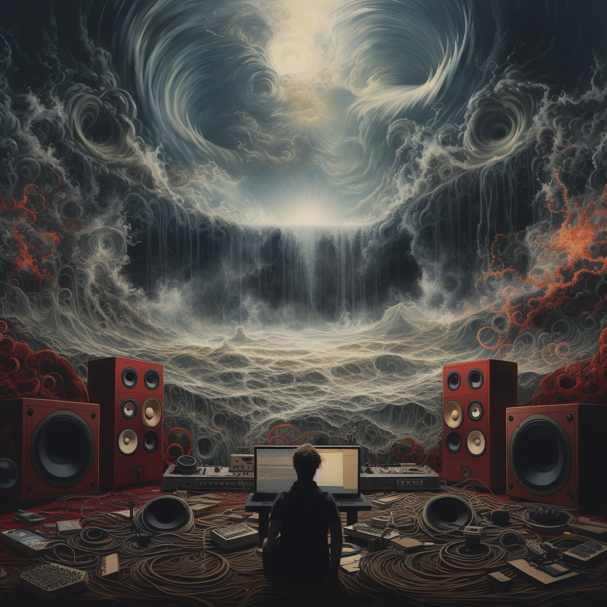

import { graphql } from 'gatsby';

### An Orchestra of Digital Voices

Imagine a symphony where every instrument has a unique, humanlike voice. And you are the
conductor! With our generative voice AI, that's no longer a pipe dream but a resounding
reality. Boasting an ensemble of over 60 lifelike voices, our advanced system is a
veritable carnival of sound that's ready to bring your ideas to life.

But don't let that number fool you - this is just the tip of the iceberg! Your journey
into the world of artificial intelligence doesn't stop at predefined options. With the
power to customize and create, you are the architect of your sound experience.

### Craft the Voice of Your Dreams

Say goodbye to voice packs and standard text-to-speech. Welcome to a world where you
hold the reins to timbre and every emotional hue. Whether you need the voice of an
old wizard for your groundbreaking game or a soothing narrative tone for your latest
audiobook, the sky's the limit with our voice generation tools.

Every story is unique, and every character deserves a voice that fits. With our voice
generation tools, the unique voices of your characters will immerse players in a world
that's as real as it is exciting.

### Prompt-to-Voice: When AI Listens to You

Yet, our mission to revolutionize auditory experiences doesn't end with mere voice
generation tools. Prompt-to-voice is ready to take your prompts (e.g. “An old man with
a gravelly voice and an American accent”) and transform them into captivating voices
that you can then use to voice your creations.

Whether you're in the gaming industry, the world of eLearning, or you're an ambitious
creative with a vision, our prompt-to-voice technology is a tool of change, of
innovation, and of progress. A tool that listens, understands, and then speaks in a
voice that's uniquely yours.

Remember, the symphony is yours to conduct. So, why not make it extraordinary? Let's
create a soundscape that's as unique as you are, and let's do it together. In the
world of sound, the future is now, and the future is ours to shape!

<Link to="https://app.coqui.ai/auth/signup">

</Link>

export const pageQuery = graphql`
  query($fileAbsolutePath: String) {
    ...SidebarPageFragment
  }
`;
