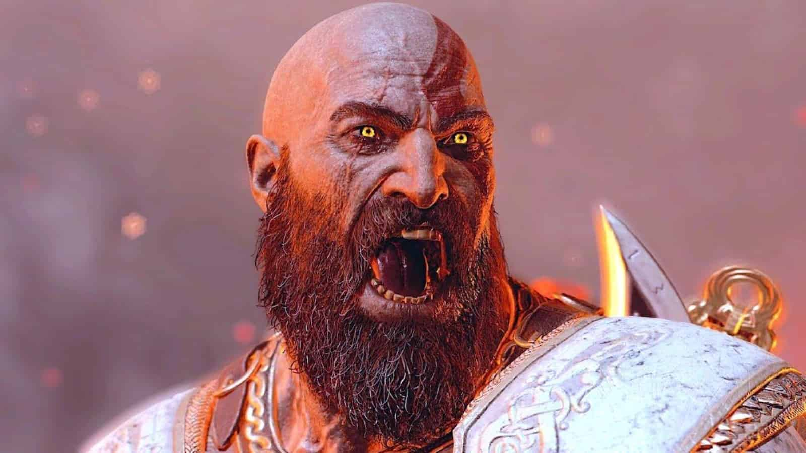

import { graphql } from 'gatsby';

### Intro

Developing a video game is like embarking on an epic journey 🗺️.

The script is your map 🗺️, the visuals breathtaking landscapes 🏞️, and the game’s sounds the conversations
of your fellow travelers. A key decision in this journey is how your game’s characters communicate -
through the written word 📖 or through spoken voice overs 🎙️?

This blog post will weigh both the pros and cons of the decision.

### Pros of Voice Overs

#### 1. Immersive Storytelling 🎭

Just as vivid descriptions of locales and events can immerse a traveler in a new world, voice overs can make
your game's storytelling engaging and personal. They add texture to your characters, making them feel alive
and relatable. Remember Kratos in _God of War Ragnarök_? His voice adds an extra layer of depth, bringing
him off-the-page in a way that text simply can’t.

#### 2. Accessibility 🌐

Voice overs make your game accessible to a wider audience, much like tour guides who can communicate in multiple
languages. For those who might struggle with reading due to dyslexia, visual impairment, or age, voice overs
are the perfect bridge, allowing players to fully immerse themselves in your game’s narrative.

#### 3. Multi-tasking Gameplay 🕹️

During intense gameplay, reading on-screen text can be at best distracting and at worst impossible. However, with
voice overs players can continue gameplay without missing crucial narrative beats, allowing them to focus on what
matters, getting that next boss!

### Cons of Voice Overs

#### 1. Cost and Logistics 💰

While adding voice overs to your game can enrich its journey, it also means a significant investment of resources.
You'll need to hire professional voice actors, arrange for sound engineers, and secure a recording studio 😓. If
your audience speaks different languages, you'll need to consider localization, which further escalate costs 💸.

#### 2. Limited Flexibility ⏰

Adding to the headaches, voice over revisions are complicated and costly. Late changes to your script or characters
require calling your voice actors back, calling your sound engineers back, arranging for new recording sessions,
and ultimately delaying your development timeline 😭.

#### 3. Potential Disconnect 🎭

Furthermore, if the voice acting doesn't match the character, it’s jarring! Remember the unintentionally humorous
voice acting in the original _Resident Evil_. This shows how critical it is to get script, casting, and performance
right.

  <iframe
    style="width:640px; height:370px;
           border-width: 1px 0px 1px 1px;
           border-style: solid solid solid solid;
           border-color: black black black black;"
    src="https://youtube.com/embed/cmP5fSQGzUQ?autoplay=1&playlist=cmP5fSQGzUQ"
    allow="accelerometer;
        autoplay; encrypted-media; gyroscope; picture-in-picture"
    allowfullscreen
  ></iframe>

### The Text Route 📝

Sticking to text can be a simpler, more flexible path. It’s easy to revise and doesn’t pose the risks of voice acting.
However, text lacks the personal touch and emotional depth that voice can provide. Furthermore, players of some genres
have simply come to expect voice overs.

Choosing between voice overs and text ultimately depends on your game's unique landscape and the preferences of your
audience. It's about balancing costs, benefits, and overall player experience.

Whether your characters communicate through text or voice, their _voices_ are core to your game. So, game developers,
plot your course wisely and may your game offer an unforgettable adventure to all who embark on it. 🎉

export const pageQuery = graphql`
  query($fileAbsolutePath: String) {
    ...SidebarPageFragment
  }
`;
