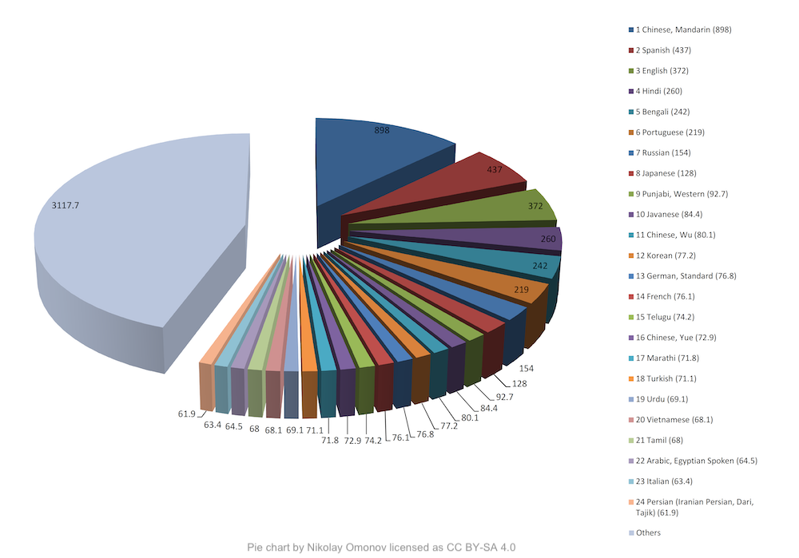

import { graphql } from 'gatsby';


### 👩‍💻Work at Coqui

By [Kelly Davis](https://github.com/kdavis-coqui)

We're still hiring!

An open source remote-friendly Berlin based startup founded by the creators of Mozilla’s
text-to-speech (TTS) and speech-to-text (STT) engines (over 725K downloads and 28K GitHub
stars), with the backing of top-flight investors _and_ we're hiring!

What’s not to love?

We’re hiring across-the-board for a number of roles; so, there’s something for everyone:

- [Head of Product](/job/head-of-product)
- [Senior Full Stack Engineers](/job/senior-full-stack-engineer)
- [Senior STT Deep Learning Engineers](/job/senior-stt-deep-learning-engineer)
- [Senior TTS Deep Learning Engineers](/job/senior-tts-deep-learning-engineer)
- [Senior, Developer Community Managers](/job/senior-developer-community-manager)

The full list of open positions is available on our [jobs page](/jobs).

We’d love to hear from you; so, if any roles pique your interest, reach out to
[jobs@coqui.ai](mailto:jobs@coqui.ai). 🐸!

### Welcome! 👋🐸

By [Kelly Davis](https://github.com/kdavis-coqui)

Ready for a new month packed to the brim with Coqui goodness?

On November 10th Coqui will present at GTC! (Yes, that GTC, a conference that had over 50K
registrants last year.) We’ll be talking about the long tail of languages, how the majority
of the world speaks a “minority” language, and what Coqui’s doing about it. If you’d like
to hear more details,
[register](https://events.rainfocus.com/widget/nvidia/nvidiagtc/sessioncatalog?search=A31147&search=A31147)!
(Also, at the end of our talk there’s a (secret) special surprise that you won’t want to
miss out on.)

🐸💬TTS v0.4.0 is out the door! The rapid progress of Coqui’s TTS engine continues. This
newest version introduces:

- Multi-speaker support for all the 🐸TTS models,
- Updated Trainer API, and
- Two new pre-trained models.

Along with much more TTS goodness.

With 🐸 STT 1.0 hot off the presses, we aren’t resting on our laurels. This month we’ve
been working on an extension of our decoder package to greatly expand STT functionality,
eventually allowing for numerous types of scorers beyond what we currently support.
The [latest 1.1.0 preview release](http://pypi.org/project/coqui_stt_ctcdecoder) exposes
APIs that cover using acoustic models trained with CTC and ASG. So, if you’re looking to
explore, this is the place.

Enjoy!

### Coqui, GTC, and the Long Tail of Languages

By [Kelly Davis](https://github.com/kdavis-coqui)



On November 10th Coqui will be afforded the honour of presenting at NVIDIA’s GTC conference
in the "[From Speech to Text: How Does AI Understand the Spoken Word](https://events.rainfocus.com/widget/nvidia/nvidiagtc/sessioncatalog?search=A31147&search=A31147)?"
session.

GTC is NVIDIA’s yearly conference which focuses largely on artificial intelligence and deep
learning, and it’s huge. Last year the conference had over 50K registrants!

Coqui’s presentation will focus on language’s long tail.

Of the world’s roughly 7K languages there are a small number of languages that have over
50 million native speakers, e.g. Mandarin, Spanish, English. However, this isn’t the
entire story. There are a large number of languages with under 50 million native speakers.
In fact as of 2011 there were over [3.1 billion native speakers](https://www.ethnologue.com/guides/ethnologue200)
of these "long tail languages". As the world’s population was [7 billion](https://en.wikipedia.org/wiki/World_population)
then, when one includes non-native speakers of these long tail languages you reach the
seemingly contradictory conclusion that the majority of the world speaks "minority"
languages?!

This leads to a massive problem: Most of the languages in the long tail have no
speech technology, but the majority of the world speaks these long tail languages.

Intrigued? If you’d like to hear more details on Coqui’s approach to the long tail,
I’d urge you to [register](https://events.rainfocus.com/widget/nvidia/nvidiagtc/sessioncatalog?search=A31147&search=A31147)
to hear what Coqui has to say.

### 🐸💬 TTS v0.4.0 is Out the Door


By [Eren Gölge](https://github.com/erogol)

This version introduces:

- Multi-speaker support for all the 🐸TTS models,
- Updated Trainer API, and
- Two new pre-trained models.

See the [release notes](https://github.com/coqui-ai/TTS/releases/tag/v0.4.0) for the details.

All the `TTS.tts` models now support multi-speaker training using speaker embedding layers.
You can find new recipes for training 🐸TTS models on the VCTK dataset and learn more about
multi-speaker training from our [documentation](https://tts.readthedocs.io/en/latest/training_a_model.html#multi-speaker-training).

The new API simplifies the Trainer by making it responsible for only the model training and
removing the use-case specific details. Now the 🐸TTS Trainer can be used as a generic
training utility for deep learning models. We are actively working and improving the Trainer
API. More updates are on the way!

We have also released two new `TTS.tts` models:

- FastPitch model trained on the VCTK dataset.

```bash
tts --model_name tts_models/en/vctk/fast_pitch --text "This is my sample text to voice." --speaker_idx VCTK_p229
```

- Ukrainian GlowTTS model from 👑 [https://github.com/robinhad/ukrainian-tts](https://github.com/robinhad/ukrainian-tts)

```bash
tts --model_name tts_models/uk/mai/glow-tts --text "Це зразок тексту, щоб спробувати нашу модель."
```

### Extending our beam search decoder package


By [Reuben Morais](https://github.com/reuben)

Coqui STT uses two main subsystems for transcribing speech: an acoustic model which processes the
audio and produces a sequence of character probabilities over time, and a beam search decoder
which transforms these probabilities into actual transcripts, possibly with the help of an
external scorer trained on text data.

Enabling usage of scorers built entirely from text data lets users customize the transcription
process in a faster and cheaper way than collecting audio for specialized vocabularies or
domains. The beam search decoder also enables features such as [hot-word boosting](https://stt.readthedocs.io/en/latest/HotWordBoosting-Examples.html),
extracting timing metadata with the outputs, constraining the output to a fixed lexicon,
as well as offering several optimization knobs to trade accuracy for speed.

As we start to experiment with new [transformer-based architectures](<https://en.wikipedia.org/wiki/Transformer_(machine_learning_model)>)
for speech recognition, it’s important to have flexibility in the beam search decoder in
order to quickly experiment with different combinations of acoustic models and textual
scorers. One can, for example, use a scorer trained on word n-grams, or character n-grams,
trading accuracy for model size and transcription speed. For acoustic model architectures
that blend the line between audio and text modelling, themselves embedding long term
textual knowledge, the decoder features allow for re-using a single high quality acoustic
model for many different tasks by constraining its recognition space to certain jargon or
a specific list of phrases and words.

In order to efficiently experiment with these new architectures, we’re integrating the
[flashlight library](​​https://github.com/flashlight/flashlight/) in our decoder
package. This means new APIs for decoding with word-based external scorers, character-based
external scorers, and acoustic models trained with CTC, ASG, or Seq2seq loss criteria.

On the [latest 1.1.0 preview release](http://pypi.org/project/coqui_stt_ctcdecoder), the
exposed APIs cover using acoustic models trained with CTC and ASG. We’re excited about
the possibilities here, and will soon be adding support for these models in the STT
deployment packages for use with our [pre-trained models](https://coqui.ai/models/).
Join [our 🐸STT chat room on Gitter](https://gitter.im/coqui-ai/STT) and get involved!

<!-- markdownlint-enable line-length -->

export const pageQuery = graphql`
  query($fileAbsolutePath: String) {
    ...SidebarPageFragment
  }
`;
