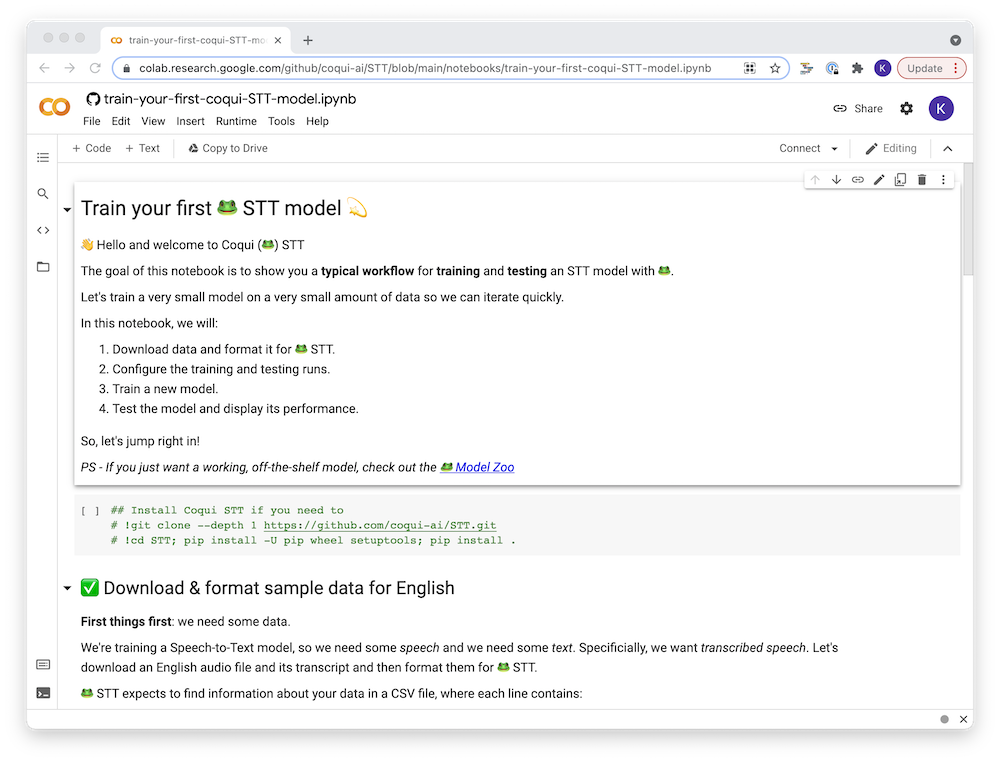
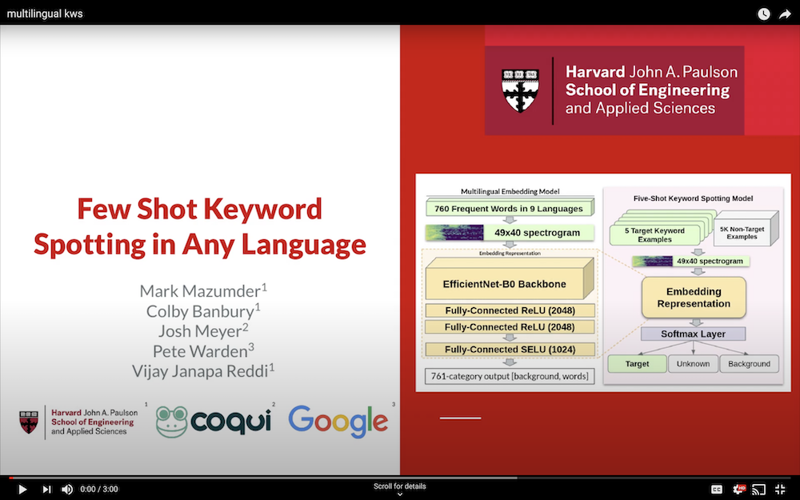

import { graphql } from 'gatsby';


### 👩‍💻Work at Coqui

By [Kelly Davis](https://github.com/kdavis-coqui)

Yeah, you heard that right; we're hiring!

An open source remote-friendly Berlin based startup founded by the creators of Mozilla’s
[text-to-speech](https://github.com/mozilla/tts) (TTS) and [speech-to-text](https://github.com/mozilla/deepspeech)
(STT) engines (over [550K downloads](https://somsubhra.github.io/github-release-stats/?username=mozilla&repository=deepspeech&page=1&per_page=300)
and 22K GitHub stars), with the backing of investors from around the globe (London,
San Francisco, and Berlin), _and_ we're hiring!

What’s not to love?

We’re hiring across-the-board for a number of roles; so, there’s something for everyone:

- [Head of Product](/job/head-of-product)
- 3 x [Senior Full Stack Engineers](/job/senior-full-stack-engineer)
- 2 x [Senior STT Deep Learning Engineers](/job/senior-stt-deep-learning-engineer)
- 2 x [Senior TTS Deep Learning Engineers](/job/senior-tts-deep-learning-engineer)
- 2 x [Senior, Developer Community Managers](/job/senior-developer-community-manager)

The full list of open positions is available on our [jobs page](/jobs).

We’d love to hear from you; so, if any roles pique your interest, reach out to
[jobs@coqui.ai](mailto:jobs@coqui.ai). 🐸!

### 👩‍🍳Welcome

By [Kelly Davis](https://github.com/kdavis-coqui)

This month we’ve cooked up a few tasty nuggets for you!

- To make training STT models even easier, we’ve brewed up two Jupyter notebooks to help with the process, a
  [Colab notebook](https://colab.research.google.com/github/coqui-ai/STT/blob/main/notebooks/train-your-first-coqui-STT-model.ipynb)
  to train from scratch and a second [Colab notebook](https://colab.research.google.com/github/coqui-ai/STT/blob/main/notebooks/easy-transfer-learning.ipynb)
  to fine-tune with.
- [Translators without Borders](https://translatorswithoutborders.org/) baked you a Bengali speech-to-text
  model that they generously released in the [Model Zoo](https://coqui.ai/bengali/twb/v0.1.0).
- Also, stars of stage and (the small) screen, we’ve stewed up a [little video](https://www.youtube.com/watch?v=2Fw3OxQrLUo)
  on our joint work with Harvard and Google.
- TTS is heating up with the release of TTS [v0.1.3](https://github.com/coqui-ai/TTS/releases/tag/v0.1.3),
  the latest and greatest version of our text-to-speech engine.

Details below the fold; enjoy the newsletter!

### 📔Jupyter Notebooks



By [Josh Meyer](https://github.com/JRMeyer)

Like Coqui? Like Python notebooks? You’re going to ❤️ this 😎.

We’ve added support for Jupyter notebooks in Coqui STT; so, you can train models easily from your browser!
Check them out on Google Colab:

1. Train a new model from scratch [Open In Colab](https://colab.research.google.com/github/coqui-ai/STT/blob/main/notebooks/train-your-first-coqui-STT-model.ipynb)
2. Train a model with transfer learning [Open In Colab](https://colab.research.google.com/github/coqui-ai/STT/blob/main/notebooks/easy-transfer-learning.ipynb)

If you want to run notebooks on your own machine, we also created a
[Coqui+Jupyter Dockerfile](https://github.com/coqui-ai/STT/blob/main/Dockerfile.train.jupyter) to make
things easier.

### 🚀 Translators without Borders Deploying Coqui’s STT


By [Josh Meyer](https://github.com/JRMeyer)

"Creating a world where knowledge knows no language barriers" - that’s the mission statement of
[Translators without Borders](https://translatorswithoutborders.org/) (TWB).

We're happy to share that 🐸 STT is becoming a part of voice-enabled applications at TWB, starting
with speech-to-text for Bengali! TWB trained a Bengali speech-to-text model, and they generously
released the model in the [Model Zoo](https://coqui.ai/bengali/twb/v0.1.0).

This Bengali model is becoming part of TWB’s online glossary application for the Bengali language,
which will enable faster search and translation.

[Alp Öktem](https://alpoktem.github.io/) (Computational Linguist at TWB and co-founder of
[Col·lectivaT](https://collectivat.cat/en)) trained the Bengali model using 🐸 STT in a little
under 10 days using about 200 hours of open-source Bengali data.

Data formatting took up the bulk of development time, but once the data was formatted, training an
STT model was “pretty straightforward” , says Öktem. Following the recommendations from a recent
[Coqui publication](https://arxiv.org/abs/2105.04674), Öktem found that fine-tuning from a
pre-trained 🐸 STT model improved performance drastically compared to training from scratch.

Keep an eye out for new models and new voice-enabled applications from TWB!

### 🎥Coqui, Stars of Stage and (the Small) Screen

[](https://www.youtube.com/watch?v=2Fw3OxQrLUo)

By [Josh Meyer](https://github.com/JRMeyer)

Previously, we let you all know about our research collaboration with Harvard and Google.
Now we have a [3-minute video overview](https://www.youtube.com/watch?v=2Fw3OxQrLUo) of
that project. The video was created with ❤️ by [Mark Mazmuder](https://markmaz.com/) from
the Harvard Edge Computing Lab.

We hope you find the video accessible and interesting; and that it gives you a better
idea of how we’re bringing speech technologies to all languages!

### Out the Door, TTS [v0.1.3](https://github.com/coqui-ai/TTS/releases/tag/v0.1.3)


By [Eren Gölge](https://github.com/erogol)

This new version fixes important issues with the new TrainerAPI and introduces various
performance improvements. Also, there is a new FullbandMelGAN vocoder released for the
Thorsten German dataset. It achieves faster than real-time inference with the Tacotron2
DDC model.

Try out the German model:

```bash
pip install TTS
tts --model_name tts_models/de/thorsten/tacotron2-DCA \
    --text "Was geschehen ist geschehen, es ist geschichte."
```

Thanks to all the contributors who helped for this release:

- 👑 [@WeberJulian](https://github.com/WeberJulian)
- 👑 [@Edresson](https://github.com/Edresson)
- 👑 [@thorstenMueller](https://github.com/thorstenMueller)

### 🔬 Monthly TTS Papers


By [Eren Gölge](https://github.com/erogol)

We’ve also read some really interesting TTS papers this month. A few which were of particular interest:

- [VITS: Conditional Variational Autoencoder with Adversarial Learning for End-to-End Text-to-Speech](https://arxiv.org/abs/2106.06103)
- [FastPitch: Parallel Text-to-speech with Pitch Prediction](https://arxiv.org/abs/2006.06873)
- [Efficient Deep Learning: A Survey on Making Deep Learning Models Smaller, Faster, and Better](https://arxiv.org/pdf/2106.08962.pdf)

**Note**: VITS and FastPitch models will be available in the next TTS release with pre-trained models. 🚀

👀 See our [TTS-papers](https://github.com/coqui-ai/TTS-papers) list for even more TTS papers!

<!-- markdownlint-enable line-length -->

export const pageQuery = graphql`
  query($fileAbsolutePath: String) {
    ...SidebarPageFragment
  }
`;
