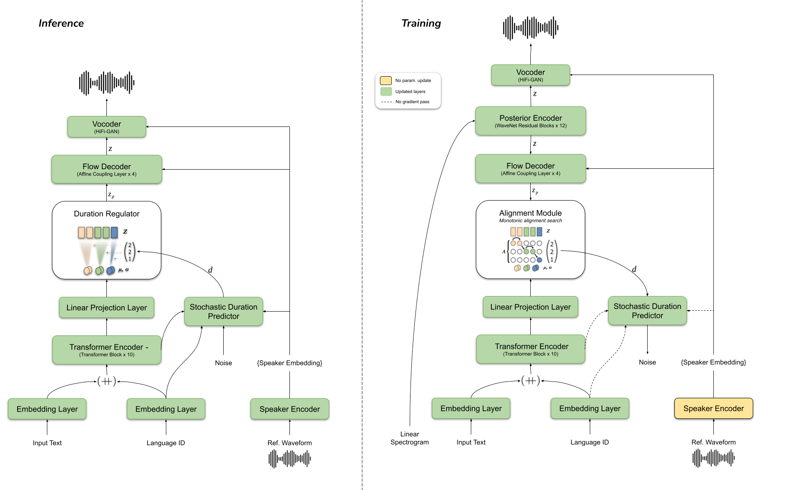
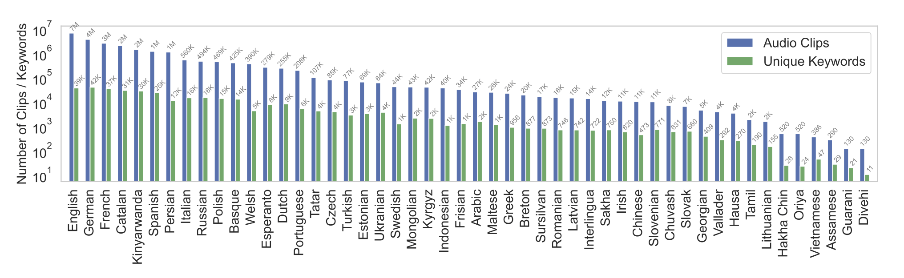

import { graphql } from 'gatsby';


### 👩‍💻Work at Coqui

By [Kelly Davis](https://github.com/kdavis-coqui)

We're still hiring!

An open source remote-friendly Berlin based startup founded by the creators of Mozilla’s
text-to-speech (TTS) and speech-to-text (STT) engines (over 750K downloads and 30K GitHub
stars), with the backing of top-flight investors _and_ we're hiring!

What’s not to love?

We’re hiring across-the-board for a number of roles; so, there’s something for everyone:

- [Head of Product](/job/head-of-product)
- [Senior Full Stack Engineers](/job/senior-full-stack-engineer)
- [Senior STT Deep Learning Engineer](/job/senior-stt-deep-learning-engineer)
- [Senior, Developer Community Managers](/job/senior-developer-community-manager)

The full list of open positions is available on our [jobs page](/jobs).

We’d love to hear from you; so, if any roles pique your interest, reach out to
[jobs@coqui.ai](mailto:jobs@coqui.ai). 🐸!

### Welcome! 👋🐸

By [Kelly Davis](https://github.com/kdavis-coqui)

Happy New Year! 🎉🎊🥳

With this new year Coqui welcomes a new member to our team, Aya AlJa'fari🎉!
Aya is joining us as a Senior Deep Learning Engineer and we feel lucky to have
her on board. Please join us in welcoming Aya 🎉!

Also we’ve added YourTTS to our TTS repo, a new model we're pretty excited about.
With only a very small amount of data it’s able to clone your voice, which is
exciting enough, but it’s also able to clone your voice into any number of languages.
You give a small English sample, then out comes a cloned voice in Brazilian
Portuguese or any number of other languages! We’ve set up a [demo](/index).
Try it out!

We’ve also released 🐸TTS v0.5.0, a new 🐸TTS version for you, delivered fresh!
With tons of new features:

- Multilingual training API
- YourTTS code and models
- Ukrainian Multi-band MelGAN

Full of goodness!

Last but certainly not least, is news from NeurIPS, the biggest deep learning
conference on the planet. Collaborating closely with Harvard, Google, and ML
Commons at NeurIPS we released the Multilingual Spoken Words Corpus! It has
340,000 keywords in 50 languages 🤯and we released it under a Creative Commons
BY-SA license! You can use it for research and production!

Enjoy the new year🎉🎊🥳

### Welcoming Aya AlJa'fari to the Coqui team


By [Reuben Morais](https://github.com/reuben)

We are very excited to announce that Coqui is growing! We welcome Aya AlJa'fari,
joining us as Senior Deep Learning Engineer and employee #1 at Coqui! Aya joins
us from Jordan and brings extensive experience building production speech-to-text
systems. Aya has impressed us from our first calls, so it is very exciting to
have her on board. Those of you following the repository have already noticed
that Aya is already hard at work improving usability and accuracy for the
🐸STT engine!

Aya has been working as a machine learning engineer for 3.5 years in the field of
speech recognition and natural language processing at Samsung Research and
Development Institute. She specializes in Electrical Engineering and Signal
Processing and has worked on the problem of speaker anonymization using GANs
in her master’s thesis. She has worked on several machine learning projects
as part of a team responsible for enhancing and expanding the language support
of Samsung’s speech recognition technology. She also developed a number of
proof-of-concepts and filed four patents in the field.

We will continue to improve our 🐸STT packages, models and training infrastructure
to bring high quality speech-to-text to a variety of languages, use cases, and
technical stacks, from research to production. Does that sound interesting?
Join our [Gitter chat](https://gitter.im/coqui-ai/STT) and
[discussion forums](https://github.com/coqui-ai/STT/discussions) to keep
up-to-date with the latest developments and to collaborate with Aya and the
rest of the team! Already an expert? [We're hiring!](/jobs)

### 👉🏽 YourTTS



By [Eren Gölge](https://github.com/erogol)

The recent surge of new end-to-end deep learning models has enabled new
and exciting Text-to-Speech (TTS) use-cases with impressive natural-sounding
results. However, most of these models are trained on massive datasets (20-40 hours)
recorded with a single speaker in a professional environment. In this setting,
expanding your solution to multiple languages and speakers is not feasible for
everyone. Moreover, it is particularly tough for low-resource languages not
commonly targeted by mainstream research. To get rid of these limitations and
bring zero-shot TTS to low resource languages, we built YourTTS, which can
synthesize voices in multiple languages and reduce data requirements significantly
by transferring knowledge among languages in the training set. For instance,
we can easily introduce Brazilian Portuguese to the model with a single speaker
dataset by co-training with a larger English dataset. The model can then speak
Brazilian Portuguese with voices from the English dataset, or we can even
introduce new speakers by zero-shot learning on the fly.

For more visit our [blog post](/blog/tts/yourtts-zero-shot-text-synthesis-low-resource-languages)

- 👉 Try out YourTTS [demo](/index) (Made with [Gradio](https://gradio.app) 👑)
- 👉 Visit YourTTS [project page](https://edresson.github.io/YourTTS/)
- 👉 Try YourTTS on [Colab](https://colab.research.google.com/drive/1ftI0x16iqKgiQFgTjTDgRpOM1wC1U-yS?usp=sharing)
- 👉 Try voice conversion with YourTTS on [Colab](https://colab.research.google.com/drive/1gjdwOKCZuavPn_5oy8QA01sKmXpEq5AZ?usp=sharing)

Big thanks to all the 🐸TTS contributors who made this work possible and to all the authors;
[Edresson Casanova](https://arxiv.org/search/cs?searchtype=author&query=Casanova%2C+E),
[Julian Weber](https://arxiv.org/search/cs?searchtype=author&query=Weber%2C+J),
[Christopher Shulby](https://arxiv.org/search/cs?searchtype=author&query=Shulby%2C+C),
[Arnaldo Candido Junior](https://arxiv.org/search/cs?searchtype=author&query=Junior%2C+A+C),
[Moacir Antonelli Ponti](https://arxiv.org/search/cs?searchtype=author&query=Ponti%2C+M+A)

### 🐸💬 TTS v0.5.0


By [Eren Gölge](https://github.com/erogol)

v0.5.0 comes with a long list of updates. Some of the important ones are:

- Multilingual training API
- YourTTS model implementation
- YourTTS model release.

For example, using YourTTS is as easy as:

```console
tts --text "this is my sample text." \
    --model_name tts_models/multilingual/multi-dataset/your_tts \
    --speaker_wav reference/voice/path.wav --language_idx en
```

Also V0.5.0 comes with

- Ukrainian Multi-band MelGAN vocoder release. (👑@robinhad)

which is callable as follows:

```console
tts --text "як ти сьогодні?" --model_name tts_models/uk/mai/glow-tts
```

Check the [release notes](https://github.com/coqui-ai/TTS/releases/tag/v0.5.0) for more details.

### NeurIPS data set + data panel



By [Josh Meyer](https://github.com/JRMeyer)

Coqui has been collaborating closely with researchers from Harvard, Google, and
ML Commons to create and deliver a first of its kind voice dataset: the
Multilingual Spoken Words Corpus.

The data set is perfect for training wakeword, hotword, or command-and-control
speech applications. It’s got a whopping 340,000 keywords in 50 languages
🤯Best part? We released it under a Creative Commons BY-SA license, so the
data’s yours for both research and production.

We presented the dataset at NeurIPS 2021, in [the inaugural Datasets and
Benchmarks track](https://blog.neurips.cc/2021/11/19/announcing-the-neurips-2021-datasets-and-benchmarks-track-papers/).
NeurIPS created this special new track “to serve as a venue for exceptional
work focused on creating high-quality datasets.”

You can watch [the official NeurIPS video presentation](https://www.youtube.com/watch?v=eGPCwnRtRng)
for yourself.

<!-- markdownlint-enable line-length -->

export const pageQuery = graphql`
  query($fileAbsolutePath: String) {
    ...SidebarPageFragment
  }
`;
