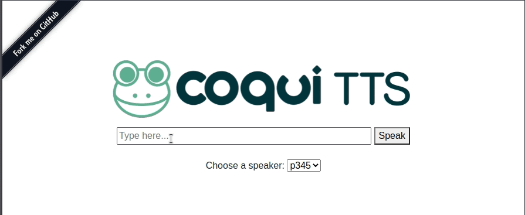

import { graphql } from 'gatsby';


### Welcome

By [Kelly Davis](https://github.com/kdavis-coqui)

Models, models, and models!

This month we’re bringing you over **70 new models**!

We’ve added new TTS models that leverage our recent research results to bring
you even higher quality speech. Not only TTS; we’ve added STT models too.
Our community created over 70 STT models in over 45 languages! The community’s
got our back!

We’re bursting at the seams with all of these new models. So we officially
opened our Model Zoo, which provides a single location to find all our models
and the models of our insanely productive community.

Enjoy 🐸!

### 🐸💬 TTS v0.0.13 is out

By [Eren Gölge](https://github.com/erogol)

In this new version we release 2 new TTS models

- **SC-Glow TTS Model** - English multi-speaker model from our latest research
- **Non-Binary English TTS Model** - English model that is outside the gender binary

and a ton of code updates.

You can use these two models and all the other released models either on the command line or with our TTS demo server.

```bash
> tts-server --model_name tts_models/en/vctk/sc-glow-tts
```



### SC-GlowTTS Model

This model is trained on [VCTK](https://datashare.ed.ac.uk/handle/10283/2651) dataset which
includes 110 English speakers with different accents. Each speaker reads out about 400
sentences. You can use this model to generate speech similar to these 110 English
speakers.

A [HiFiGAN](https://arxiv.org/abs/2010.05646) vocoder accompanies this model too, to convert
the output features to the speech waveform. The whole system is able to generate speech
almost faster than real-time on a CPU with a high quality.

You can find more details about SC-GlowTTS in our latest [paper](https://arxiv.org/abs/2104.05557).

#### Non-Binary English TTS Model (Joint w/Accenture)

We worked with [Accenture Labs](https://www.accenture.com/us-en/about/accenture-labs-index) to create a
non-binary, general purpose TTS voice.

This is an important step forward to embrace social diversity in speech tech. We’re
thankful to Accenture Labs for helping us to make this possible.

This model uses [Tacotron2 Double Decoder Consistency](https://coqui.ai/blog/tts/solving-attention-problems-of-tts-models-with-double-decoder-consistency/)
with a [HiFiGAN](https://arxiv.org/abs/2010.05646) vocoder that in combination, delivers
real-time speech synthesis.

### Model Zoo

By [Josh Meyer](https://github.com/JRMeyer)


On [April 12](https://twitter.com/coqui_ai/status/1381634290891493377) we officially opened
the [Coqui model zoo](https://coqui.ai/models), and we are already hosting 73 open models
in 48 languages from 11 community members and organizations!

The community has been asking for this model zoo for a long time, and we're happy to have
so many great contributions so fast. This was not possible without your support, and we
owe a big thank you to all the folks who put in the time and effort to train these models!

The model zoo is a public repository where you can browse and download pre-trained models
to deploy with Coqui tools. Pre-trained Speech-to-Text models are easily adaptable to
your specific use-case via an external, custom language model. If you have text data
related to your use case, you can [easily train a new language model](https://stt.readthedocs.io/en/latest/LANGUAGE_MODEL.html)
for any of the released STT models, and get better performance for your application.

We want to support anyone who is training their own models and wants to publish their
models to the zoo, so get in touch with us on [Gitter](https://gitter.im/coqui-ai) and
let's open-source more and better models for all languages!

Thank you to model contributors so far:

- [Yurii Paniv](https://github.com/robinhad/)
- [Dewi Bryn Jones](https://github.com/dewibrynjones/)
- [Ciaran O'Reilly](https://github.com/ccoreilly)
- [Aashish Agarwal](https://github.com/AASHISHAG)
- [Vojtěch Drábek](https://github.com/comodoro)
- [Daniele Scasciafratte](https://github.com/Mte90) + [Mozilla Italia](https://github.com/MozillaItalia)
- [Francis Tyers](https://github.com/ftyers/) + [ITML](https://itml.cl.indiana.edu/)
- [Digital Umuganda](https://digitalumuganda.com/)
- [Jaco Assistant](https://gitlab.com/Jaco-Assistant)
- [Common Voice FR](https://github.com/common-voice/commonvoice-fr)

### STT Model Sprint

By [Josh Meyer](https://github.com/JRMeyer)


Over the last 3 weeks, one of our core contributors embarked on a model-training sprint to
produce as many open STT models as possible for under-served languages. By the end of the
sprint, Francis Tyers (Professor of Computational Linguistics at Indiana University Bloomington)
had produced models for 34! languages.

This model training sprint was important not only because it resulted in the release of
open STT models, but also for the very practical training implications from his findings.

Tyers set out to find a set of reproducible steps and methods for training any new language
with Coqui STT, using Transfer Learning and smarter hyperparameter search. During the
sprint, Tyers also created an [open-source command line tool](https://github.com/ftyers/commonvoice-utils)
(compatible with Coqui STT) for pre-processing speech data and creating language models.

The dataset for each language ranged from a mere 30 minutes to a maximum of 12
hours — in any case a very small speech corpus.

### New STT Packages

By [Reuben Morais](https://github.com/reuben)


Since our last newsletter, we’ve been hard at work to bring our entire matrix of supported
architectures, platforms, and programming languages up to speed in our new Continuous
Integration (CI) system. In the meantime, we’ve brought up Linux, macOS, and Windows
builds and tests for our Python and NodeJS/ElectronJS packages, including Raspbian
and ARMBian Linux on ARMv7 and Aarch64.

In the coming weeks we’ll be working to bring up the rest of our supported packages,
including our Java/Android AAR package and our .NET package on NuGet. If you’re
interested in this work, please get in touch on our [STT chat room](https://gitter.im/coqui-ai/STT)
on Gitter.

Version 0.10.0a6 of our packages is now available on PyPI and npmjs for all the platforms
mentioned above. Because PyPI does not support Raspbian and ARMbian, you can grab the
Python wheels directly from our release page. Check out our documentation for how
to get started using our pre-built packages to leverage speech-to-text in your
applications.

<!-- markdownlint-enable line-length -->

export const pageQuery = graphql`
  query($fileAbsolutePath: String) {
    ...SidebarPageFragment
  }
`;
