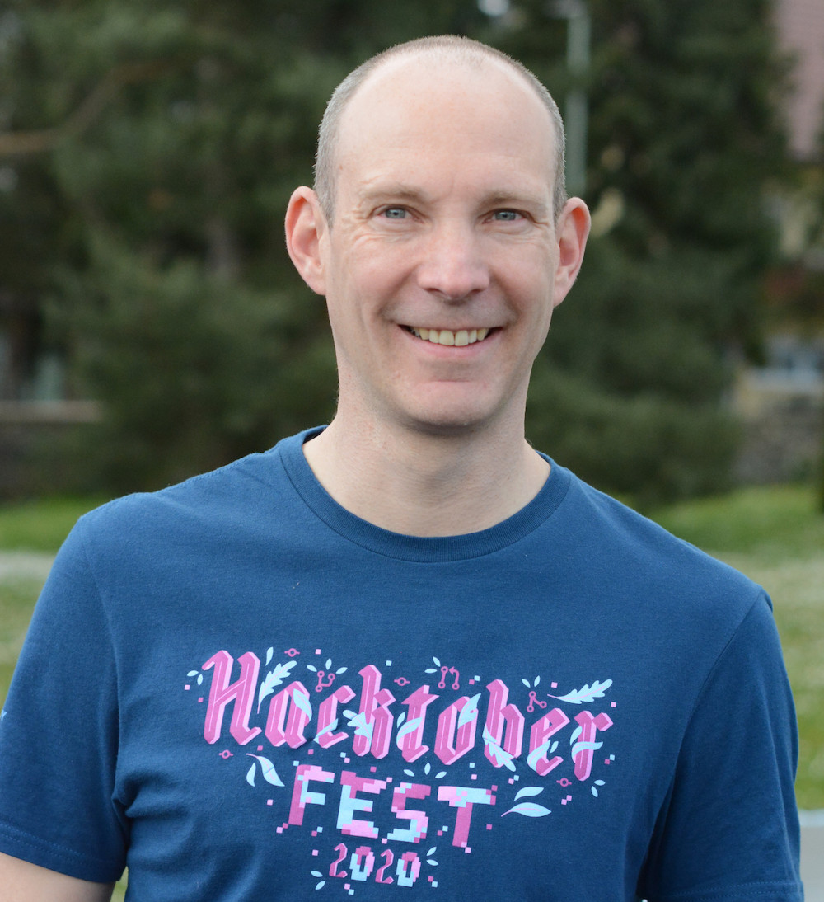
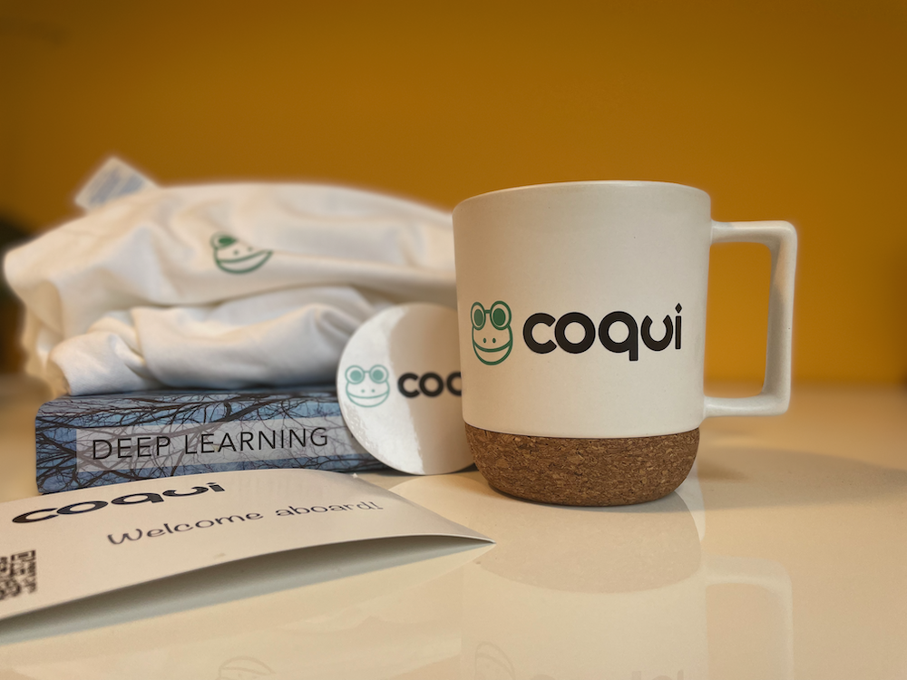
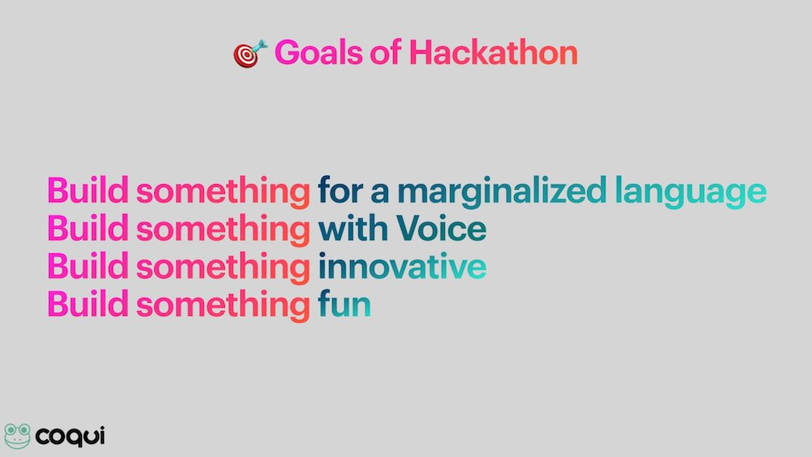

import { graphql } from 'gatsby';

### Winke Winke! 👋🐸

By [Kelly Davis](https://github.com/kdavis-coqui)

This month we got our patent pending Coqui goodness brewing up hot for you!

This month we’re gonna let This Little Light of Ours shine on our community,
in particular Thorsten Mueller who has been doing amazing work “fighting the
good fight” for open speech. Listen to his TTS models!

  <audio
    controls
    src="https://coqui-ai-public-data.s3.amazonaws.com/newsletter/audio/thorsten-on-berlin.wav"
  >
    Your browser does not support the
    <code>audio</code> element.
  </audio>

Breathtaking!

In this newsletter we also want to highlight some of the 🔥💯amazing💯🔥 talent
we’ve recently brought on-board, a quartet of new hires that’s rounding out our
TTS and MLOps teams with their amazing skills👏👏👏👏. (And their amazing swag😎.)
Details below the fold!

Finally, we wanted to circle back on the #HackThePlanet hackathon, run jointly by
Mozilla and Coqui, by paying homage to all the participants and winners!

Enjoy the newsletter! 🐸

### Community Spotlight: Thorsten Mueller 🇩🇪💬

By [Coqui🐸](https://github.com/coqui-ai)

This month we wanted to shine our spotlight on Thorsten Mueller. Thorsten has been
“fighting the good fight” for open speech for some time now, creating free open
high-quality German TTS voices. Here is a prime example of his work

  <audio
    controls
    src="https://coqui-ai-public-data.s3.amazonaws.com/newsletter/audio/thorsten-on-berlin.wav"
  >
    Your browser does not support the
    <code>audio</code> element.
  </audio>

As you can tell from the quality of TTS voices he’s created, his passion for open
speech has led him to produce models that are basically indistinguishable from
humans. Quite an achievement! 👏👏👏

Not only does Thorsten create flawless TTS models and release them under an open
license for the good of open speech, he teaches others how to do the same!
He's created a [YouTube channel](https://www.youtube.com/c/ThorstenMueller/videos)
that walks you through the details of how he gets his TTS to “sing”.

I don’t know how he finds the time to juggle all of this and a full-time job! Hats
off to Thorsten! We’re lucky to have him as part of our community!💥🔥💯👏👏👏

### Coqui’s New Hires 🐸🐸🐸🐸

By [Coqui🐸](https://github.com/coqui-ai)

Coqui is growing by leaps and bounds (👶➙🧒➙🧑➙🦄) and with that comes new hires.

And we’ve just landed quite the quartet:

- [Edresson](https://github.com/Edresson) - A talent🧨 at TTS and freshly minted PhD from University of São Paulo.
- [Görkem](https://github.com/gorkemgoknar) - The MLOps wizard 🧙‍♂️ previously at Turkcell and Nokia.
- [Julian](https://github.com/WeberJulian) - A TTS talent🔥 previously at Sopra Banking Software and BNP.
- [Logan](https://github.com/loganhart420) - A TTS intern extraordinaire from NKU and a diamond💎 rounding out the TTS team.

With these hires, we’ve doubled our size in a matter of months!✨🧨🔥🔥

We’re lucky to have all of them on-board as they’re all supremely talented, not to
mention a pleasure to work with. This 🐸 is on 🔥!

### Coqui Swag 😎

By [Coqui🐸](https://github.com/coqui-ai)

Naturally we welcomed all the new hires with Swag😎!

So, if you want swag😎 or just want the opportunity to work on the cutting edge of
speech tech, then checkout our [open positions](/jobs) and join us in our mission
to bring speech technology to the world’s _other_ 7000 languages

### &#35;HackThePlanet HaCkAtHoN 😼💻

By [Coqui🐸](https://github.com/coqui-ai)

Mozilla and Coqui teamed up to #HackThePlanet, staging a unique hackathon focused
on building real, voice-enabled products.

Participants pulled down pre-trained speech-to-text and text-to-speech models and
went to work building product! (None of that pesky machine learning getting in
the way!😉)

The creativity of the participants was reflected in the breadth of ideas considered:

- TTS for people who have lost the power of speech
- STT + Translation engine for people who share no common language
- STT plugin to transcribe meetings for video conferencing platforms
- Along with many others, too many to mention!

However, the winner wasn’t judged on creativity alone, but on creativity _and_ execution,
and Team Tichyen executed, creating [3d-voice-chess](https://github.com/HarikalarKutusu/3d-voice-chess)
a 3D voice powered chess game in the blink of an eye. All hail Team Tichyen! And all
hail all the other teams that participated! 👏👏👏

<!-- markdownlint-enable line-length -->

export const pageQuery = graphql`
  query($fileAbsolutePath: String) {
    ...SidebarPageFragment
  }
`;
