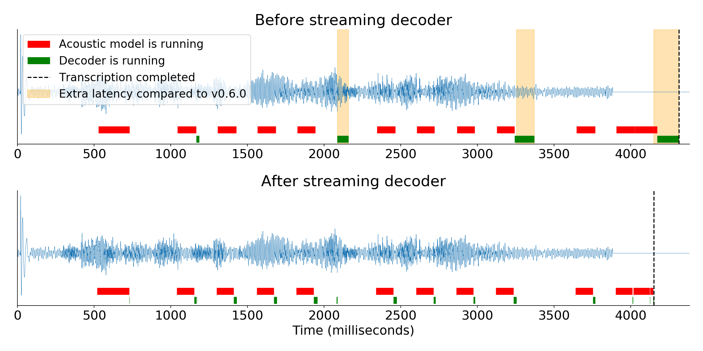

import { graphql } from 'gatsby';


### 👩‍💻Work at Coqui

By [Kelly Davis](https://github.com/kdavis-coqui)

We're still hiring!

An open source remote-friendly Berlin based startup founded by the creators of Mozilla’s
[text-to-speech](https://github.com/mozilla/tts) (TTS) and [speech-to-text](https://github.com/mozilla/deepspeech)
(STT) engines (over [650K downloads](https://somsubhra.github.io/github-release-stats/?username=mozilla&repository=deepspeech&page=1&per_page=300)
and 23K GitHub stars), with the backing of top-flight investors _and_ we're hiring!

What’s not to love?

We’re hiring across-the-board for a number of roles; so, there’s something for everyone:

- [Head of Product](/job/head-of-product)
- [Senior Full Stack Engineers](/job/senior-full-stack-engineer)
- [Senior STT Deep Learning Engineers](/job/senior-stt-deep-learning-engineer)
- [Senior TTS Deep Learning Engineers](/job/senior-tts-deep-learning-engineer)
- [Senior, Developer Community Managers](/job/senior-developer-community-manager)

The full list of open positions is available on our [jobs page](/jobs).

We’d love to hear from you; so, if any roles pique your interest, reach out to
[jobs@coqui.ai](mailto:jobs@coqui.ai). 🐸!

### Hello! 👋🐸

By [Kelly Davis](https://github.com/kdavis-coqui)

We’ve got quite a month for you🚀!

The [1.0 release](https://github.com/coqui-ai/STT/releases/v1.0.0) of Coqui 🐸STT is here🎊!
It’s been brewing for quite some time, but we feel it’s finally ready! 1.0 brings with it
a ton of features:

- Exclusive use of TensorFlow Lite
- Experimental iOS support
- Built-in support for transfer learning and fine tuning
- Support for using our training and evaluation tools from Jupyter Notebooks,

and a lot more!

Alongside the Coqui 🐸STT 1.0 release, we’re also releasing our best ever
[English STT model](https://coqui.ai/english/coqui/v1.0.0-huge-vocab)!
It was trained on almost 47,000 hours of English and can outperform humans🤯! We’ve come a
long way!

If that wasn’t enough, we’re also releasing a new version of our TTS engine
[v0.3.0, 🐸TTS](https://github.com/coqui-ai/TTS/releases/tag/v0.3.0). The new version
introduces a New [ForwardTTS API](https://tts.readthedocs.io/en/latest/models/forward_tts.html),
An English [SpeedySpeech](https://arxiv.org/abs/2008.03802) model trained on LJSpeech
(the most compact TTS model we’ve released to the date), and A fine-tuned
[UnivNet](https://arxiv.org/abs/2106.07889) vocoder, and a lot more TTS goodness.

We’ve also doubled down on STT responsiveness. Latency matters a lot! For the Coqui 🐸STT 1.0
release we spent a ton of time optimizing the inference library that powers all 🐸STT packages,
and it shows. It’s lean, streamable, and loads from disk in the blink of an eye.

Also, as always, over the last month we’ve been spreading the “word of Coqui”. We spoken at the
[Voice Lunch](https://voicelunch.com/), to the students of [University of Groningen’s new
MSc in Voice Technology](https://www.rug.nl/masters/voice-technology/), and at Hyde Park’s
Speakers' Corner soapbox. (Well, not really the Hyde Park bit.)

Anyway, enjoy the newsletter!

### Coqui 🐸STT 1.0 Released


By [Reuben Morais](https://github.com/reuben)

Today Coqui is proud to release [Coqui STT 1.0](https://github.com/coqui-ai/STT/releases/v1.0.0),
the first stable release of our open source speech-to-text engine. Coqui STT offers high quality,
offline speech-to-text technology that's simple to integrate into your applications, thanks to
our easy to use API which supports multiple architectures, platforms, and programming languages.

We have continuously worked to make our speech-to-text engine faster, more capable and easier to
use. Developers are already relying on our technology to build voice powered applications around
the world (and maybe even on the moon!). Today, we are proud to announce our first stable release.
When you integrate Coqui STT 1.0 into your application, you’ll be able to easily upgrade to newer
1.x versions and take advantage of performance improvements and bug fixes without having to change
your code.

Coqui STT 1.0 is available for download from our [release page](https://github.com/coqui-ai/STT/releases/v1.0.0).
Since our last release, 0.9.3, we've continued to work on performance, stability, flexibility and
accuracy. We've

- Moved exclusively to TensorFlow Lite to make sure our most important runtime variant receives full attention and care,
- Released experimental iOS support,
- Landed built-in support for transfer learning and fine tuning,
- Added support for using our training and evaluation tools from Jupyter Notebooks,
- Streamlined alphabet generation and dataset splitting,

and more!

Try Coqui STT today by following our [usage guide](https://stt.readthedocs.io/en/latest/) for your
favorite programming language. Our [1.0 English model](https://coqui.ai/english/coqui/v1.0.0-huge-vocab) has
been trained on over 47 thousands of hours of speech data, including the latest release of the
Common Voice dataset with 2000 hours of speech. It is available for download in the
[Coqui Model Zoo](https://coqui.ai/english/coqui/v1.0.0), where we also document all of the training
parameters that were used to create it. You can also find our latest release in your favorite package
manager: we offer packages for Python, Node.JS, Electron, Java on Android, and C/C++.

### 🔥 Best EVER 🐸STT English model 🔥


By [Josh Meyer](https://github.com/JRMeyer)

This is a very exciting day for us, because we are releasing our best ever Speech-to-Text model for
English!

We trained this model on almost 47,000 hours of English 🤯 ... And it shows

#### 👉 Accurate

✔️ Huge improvement in accuracy over all past versions

With this new model, we get 4.5% word error rate on Librispeech clean (better than humans!). Our
previous v0.9.3 model has a 7.1% WER, so you should upgrade as soon as possible to feel the
difference:)

More diverse voices in the training data means better demographic representation, and better
representation means better Speech-to-Text for everyone!

#### 👉 Fast && Local && Small

✔️ It runs on your computer

✔️ It runs on your phone

✔️ It runs on your watch

We've doubled down on making models go everywhere you go. For the first time, we're releasing two
versions of the model ready for Tensorflow Lite, in two sizes: small and extra-small:)

Don't let the sizes trick you, both these models are ready for the big leagues. The extra-small
model has optimally quantized weights, bringing this (open vocabulary!) speech recognizer down
to just 46 Megabytes. Oftentimes your application will benefit from a language model, which
comes with a size↔️accuracy tradeoff. We are releasing a few language models so you can try out
for yourself a language model under a kilobyte versus one in the order of Gigs. Depending on your
application, you can choose the right model for you… or you can build your own!

#### 👉 Easy to Customize

STT is built so that you can easily improve performance for your application, no matter how
specific or how rare the vocabulary.

If you've got doctors talking about doctor things, no problem! Lawyers talking about lawyer
things? No sweat 😎 No human knows all the jargon in all domains, but anyone can learn...
And the same goes for Coqui STT!

This kind of customization happens at the language model, and you can easily (and quickly!)
create custom language models for your custom applications.

#### 👉 Download it yourself

✔️ Newest member of Model Zoo

✔️ Apache 2.0 licensed

We love open source, and we're releasing this new v1.0.0 model under the Apache 2.0 license 🎉

Download this new model from the Coqui model zoo, and check out all the other community models!

### v0.3.0, 🐸TTS Delivered Fresh


By [Eren Gölge](https://github.com/erogol)

This new version introduces a new [ForwardTTS API](https://tts.readthedocs.io/en/latest/models/forward_tts.html)
and 2 pre-trained models, an English [SpeedySpeech](https://arxiv.org/abs/2008.03802) model
trained on LJSpeech and a fine-tuned [UnivNet](https://arxiv.org/abs/2106.07889) vocoder.

Forward TTS API provides a unified interface for all the current and future feed-forward TTS
models. We currently support [SpeedySpeech](https://arxiv.org/abs/2008.03802),
[FastPitch](https://arxiv.org/abs/2006.06873), [FastSpeech](https://arxiv.org/abs/1905.09263)
architectures through this API. You can also create your own custom architectures by defining
your own Encoder, Decoder networks without any other fine-grained changes.

We are also releasing the following pre-trained models:

- English [SpeedySpeech](https://arxiv.org/abs/2008.03802) model trained on the LJSpeech dataset.
  This is the most compact TTS model we’ve released to the date.

```bash
tts --text "This is a sample text for my model to speak." --model_name tts_models/en/ljspeech/speedy-speech
```

- [UnivNet](https://arxiv.org/abs/2106.07889) vocoder fine-tuned for the above model.

```bash
tts --text "This is how it is." --model_name tts_models/en/ljspeech/tacotron2-DDC_ph
```

Check the [release notes](https://github.com/coqui-ai/TTS/releases/tag/v0.3.0) for all the details
of the release and [dev plans](https://github.com/coqui-ai/TTS/issues/378) to see what is next.

### 📎TTS papers picks of the month


By [Eren Gölge](https://github.com/erogol)

#### Towards Universal Text-to-Speech ([PDF](http://www.interspeech2020.org/uploadfile/pdf/Wed-3-4-3.pdf))

This paper presents a multilingual TTS framework that can be trained on 1250 hours of professional recordings
from multiple languages and then fine-tuned with new speakers and languages with only 5-6 minutes of recordings.

The model proposed in the paper comprises an encoder-decoder Transformer model with a speaker and language
conditioning networks and a WaveNet vocoder. The conditioning networks take one-hot vectors representing
the speaker or language ID and project to a hidden conditioning representation that is concatenated to
the encoder output.

This show that this model can learn low-resource languages that cannot be learned by single speaker models
due to insufficient data. In their experiments, a single speaker model needs at least 3 hours of recordings
whereas the proposed model is able to learn with only 6 minutes.

#### AdaSpeech: Adaptive Text to Speech for Custom Voice ([PDF](https://openreview.net/pdf?id=Drynvt7gg4L))

This paper presents a way to learn new speakers with a single backbone architecture while keeping the number
of new parameters introduced to the system small.

The overall architecture is based on the FastSpeech2 model with Pitch and Variance predictors. They also
introduce 3 more conditioning networks for better understanding the acoustic properties of a speaker.

All the networks use Layer Normalisation at different stages. They proposed Conditional Layer Normalisation
as a means to reduce the complexity required for fine-tuning with each new speaker.

They propose to train separate Speaker Conditioning modules to predict the scale and bias values for each
Layer Normalisation layer. This way, they are able to store only these Speaker Conditioning modules for
each speaker and keep the rest of the model the same as they add more speakers to the system

### 🏃🏿 Building Coqui STT for responsiveness


By [Reuben Morais](https://github.com/reuben)

One of the most exciting aspects of working on speech technology is the promise of a future where interactions
with devices can be as fluid and effortless as telling someone what you're trying to achieve. To be understood
by devices rather than needing to learn many languages.

In everyday usage, we usually start off with a very clear task in mind: check the shipping status of the thing
you ordered last week, try to find a good day and time to fit a coffee and catch-up with a friend, make sure
you're not forgetting any of the documents you're supposed to bring for the visa application. But before you
can accomplish those tasks, you have to convert them into sequences of steps in a language that your phone
can understand.

We're all essentially programming our devices, and not in a fun, playful way: we still have to work to get
them to do very simple tasks. As the technical capabilities of consumer devices grow more and more, so does
the complexity of the languages we use to control them. As these devices become more ubiquitous and more
interactive, from wearables to virtual reality to brain-computer interfaces, we need better ways to interact
with and control our devices, if we want to explore all their potential.

At Coqui we believe conversational interfaces are the key to solving many of these user experience problems
and multiplying the potential of what devices can do for all people, even those who aren't great fans of
programming. Speech technology has made great strides in the past few years: we've built systems that learn
languages by themselves, and that often perform better than humans. But there's also still a lot to do:
speech AI needs to speak many more languages, it needs to be more intelligent and adaptable, and it needs to
be more responsive.

We're hard at work making this a reality: a key focus of our speech-to-text engine Coqui STT has been
responsiveness, from the conception of the project. Latency in user interactions matters. A lot. Ask a user
experience designer. Ask someone who works on optimizing conversions. Or just remember what it feels like to
have a weird conversation filled with awkward silences. This is why we spent a ton of time optimizing the
inference library that powers all 🐸STT packages: keeping the core library lean, making it end-to-end
streamable, using efficient data structures that can be loaded quickly from disk, and testing it extensively.



We've previously talked about some of this work, such as the changes needed to make the entire inference
process streamable. The diagram above shows the latency gains from this change alone. You can read more
about it in [our blog post](https://coqui.ai/blog/stt/deepspeech-0-6-speech-to-text-engine).

We think responsiveness is crucial for building engaging, enjoyable user experiences with speech. We will
continue to push the boundaries of performance for speech AI, creating more accurate and more efficient
models, moving processing as close as possible to end users. We'll make it as easy as calling a SaaS
endpoint on a datacenter half a continent away, but with snappy responses for engaged conversations without
awkward silences.

If this sounds like something you'd like to work on, [we're hiring](https://coqui.ai/jobs)! Coqui is looking
for talented engineers with experience in speech AI, MLOps and full stack web development. Come help us
make this future a reality!

### 🍱 Voice Lunch


By [Josh Meyer](https://github.com/JRMeyer)

Coqui made its first appearance on [Voice Lunch](https://voicelunch.com/). Our co-founder, Josh Meyer, walked a
virtual room full of linguists (many of whom don’t usually write code) through one of our beginner-friendly
Python notebooks. Each participant was able to train a speech-to-text model for the Serbian language, on their
very own!

Check out the [notebook](https://colab.research.google.com/github/coqui-ai/STT/blob/main/notebooks/train_with_common_voice.ipynb)
for yourself and train your own model… you don’t have to know how to code, and it’s fun!

### 🎓 University of Groningen


By [Josh Meyer](https://github.com/JRMeyer)

Coqui has already made its way into the curriculum of the next generation of Speech Tech developers. Josh Meyer
gave [an invited lecture](https://docs.google.com/presentation/d/1nz0PAFfApny3rfZM3v_BUOIlJRy4XR1Jys3TOWNllPY/edit?usp=sharing)
to the inaugural class of Masters students at the [University of Groningen’s new MSc in Voice Technology](https://www.rug.nl/masters/voice-technology/).
These students will be building the future of voice, and they’re starting their journey with Coqui in their
toolbox.

The presentation covered both STT and TTS, with a walk-through of one of our
[Python notebooks](https://colab.research.google.com/github/coqui-ai/STT/blob/main/notebooks/train_with_common_voice.ipynb).
The University of Groningen is located in a Frisian-speaking region of the Netherlands, and there’s a keen
interest in traditionally under-served languages among students and faculty. Coqui’s fine-tuning capabilities
and multilingual lean make it a great fit for this next generation of language technologists.

<!-- markdownlint-enable line-length -->

export const pageQuery = graphql`
  query($fileAbsolutePath: String) {
    ...SidebarPageFragment
  }
`;
