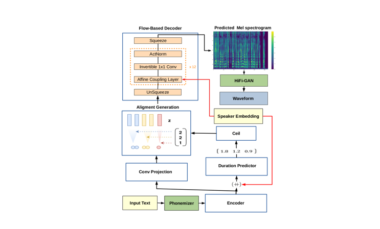
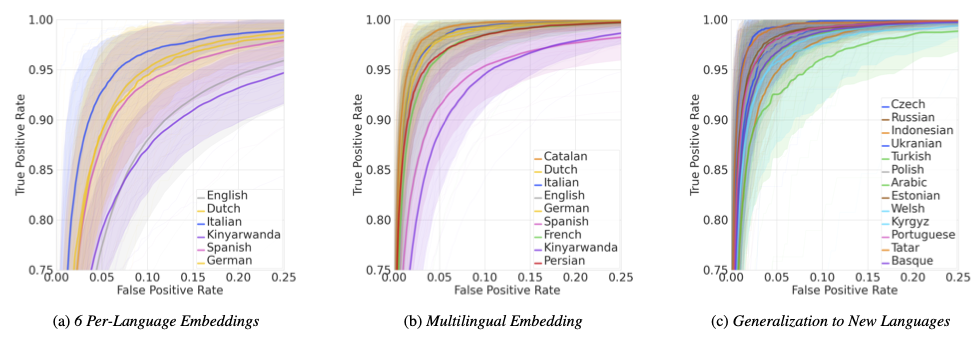

import { graphql } from 'gatsby';


### Welcome

By [Kelly Davis](https://github.com/kdavis-coqui)

Years ago now, I remember starting work on the speech recognition engine that would become the core of
[Coqui 🐸 STT](https://github.com/coqui-ai/STT). Then it was only a dream, creating open source speech
technology that brought research into the hands of the enterprise and regular developers. But here we
are, years later, and Coqui is a reality.

We’ve grown a lot since then. [Coqui 🐸 STT](https://github.com/coqui-ai/STT) has gone from aspiration
to a actuality, powering the enterprise and providing speech technology to numerous low-resource languages.
Also, [Coqui 🐸 TTS](https://github.com/coqui-ai/TTS), through that same dream, was born, bringing open,
[human-quality](https://github.com/coqui-ai/TTS#-tts-performance) speech synthesis to regular developers
and the enterprise.

I am grateful that you are joining us on this journey, and I want to personally thank everyone who has ever subscribed
to our newsletter, used our software, downloaded a model, filed a bug report, joined our
[discussion forms](https://gitter.im/coqui-ai), or simply given us a ⭐ star on GitHub. Thank you!

Stay tuned; there’s much more to come! 🐸

On to our first, monthly newsletter where you'll hear what we are up to and general reflections on speech tech!

### Coqui STT Playbook

By [Reuben Morais](https://github.com/reuben)


Getting started with speech-to-text can be somewhat intimidating. There are new terms to learn, tools and
pipelines to get acquainted with, and a whole lot of excitement about the speech experiences you can build.
At Coqui, we want developers to be able to focus entirely on that last part: let their creativity run wild
so they can build applications, systems, and experiences using speech that will redefine how users interact
with technology in the future.

With that in mind, Coqui co-founder [Josh Meyer](https://mobile.twitter.com/_josh_meyer_) started a "playbook":
a complement to our technical documentation that told a cohesive story from start to end, covering the entire
process of getting familiar with Coqui 🐸 STT (and STT in general), defining all the pieces of the puzzle and
how they fit together, and then walking you through the process of collecting and refining your data,
training models and getting confident in how they work, and finally deploying your model on your platform
and in your programming language of choice.

This idea resonated with the community, and things really kicked into high gear when [Kathy Reid](https://twitter.com/KathyReid)
joined forces in the creation of the playbook. The result is an opinionated guide that is meant as a smooth
onboarding process for getting familiar with STT, getting developers from zero to a working speech-to-text
system, and giving them the knowledge and confidence to start tweaking with their processes and finding the
best tailored way to make speech work for them.

At Coqui, we want to take this idea to the next level: we want developers to be able to build speech experiences
effortlessly, as well as to easily share their work with the speech community - be it tools, models, new
architectures, or datasets. As a first step, we have released the updated [STT playbook](https://stt.readthedocs.io/en/latest/playbook/README.html),
readable now on our main documentation site. We will continue to refine our documentation, tools, and models
working together with our brilliant community to bring speech research into reality.

Don't forget to check out the updated [STT playbook](https://stt.readthedocs.io/en/latest/playbook/README.html)
and [join our growing speech community](https://gitter.im/coqui-ai).

### SC-GlowTTS: An Efficient Zero-Shot Multi-Speaker TTS Model

By [Eren Gölge](https://github.com/erogol)



At Coqui, we're motivated to provide speech technology for all languages and people. One of the problems we've
encountered along way is data-hungry machine learning models. For some languages the data simply isn't there!
Finding enough data is hard, and even if it's available, training machine learning models is difficult too.

To solve a part of this problem for text-to-speech tasks, we investigated different [zero-shot learning](https://en.wikipedia.org/wiki/Zero-shot_learning)
approaches using state-of-the-art text-to-speech models. (Zero-shot learning techniquies can greatly reduce
data requirements for some algorithms.) This investigation bore fruit! We came up with a new algorithm we
christened "SC-GlowTTS", a catchy name I know. SC-GlowTTS can generalize to novel speakers after training
with only 11 speakers for the target language. This means we need less data!

Soon after this newsletter finds its way into your hands, we'll release SC-GlowTTS's code, models, and an
associated article. Please stay tuned! But, if you can't wait, check out the SC-GlowTTS
[project page](https://edresson.github.io/SC-GlowTTS/).

This is a work of all the Coqui 🐸 TTS community but special thanks to the main author
[Edresson Casanova](https://github.com/Edresson) who organized and did the brunt of the work and
[Nicolas Michael Müller](https://github.com/mueller91) for training the most expansive open
source speaker encoder, which we used in this work.

It is great to see how an open community of great developers and researchers can innovate without borders.
We hope this is just a start for us and our great community to pave the way for open source TTS.

### Few-Shot Keyword Spotting in Any Language

By [Josh Meyer](https://github.com/JRMeyer)



We have traditionally focused on open vocabulary speech-to-text at Coqui, but now we are expanding to new
horizons.

The flexibility of open vocabulary STT is great: you can say literally anything to a
[Coqui 🐸 STT](https://github.com/coqui-ai/STT) model, and it will transcribe it. However, there are many
applications where you don't need to transcribe every word, you just need to spot a few keywords in the
stream of audio. One common application of this is wake word detection, e.g. "[Hey, Computer](https://www.youtube.com/watch?v=1ZXugicgn6U)".
For the task of wake word detection, deploying a large, open vocabulary STT model is impractical on edge devices.
(Edge devices have very small compute resources and assume limited power consumption.) As such, we've begun
research into robust, multilingual, practical model architectures for keyword spotting.

Collaborating with researchers from [Harvard University](https://edge.seas.harvard.edu/) and
[Google](https://www.tensorflow.org/lite), Coqui co-authored a publication on an
extremely efficient keyword spotting technique that scales to any language. The training technique is
intuitive and it works: we first train a base model to classify lots of keywords in lots of different
languages. This is a classification model, not a transcription model. This base model does really well
for the keywords on which it was trained, but we really care about how well this model can perform on
new keywords that it's never heard in new languages. The answer: it does great! We can fine-tune this
base model to any new keyword in any language with just five audio clips of the new word.

We submitted this work to the [INTERSPEECH 2021](https://www.interspeech2021.org/) conference. Wish us luck
on acceptance! Until INTERSPEECH 2021, let us whet your appetite with this teaser, the abstract for the
paper:

**Abstract:**
We introduce a few-shot transfer learning method for key-word spotting in any language. Leveraging open
speech corpora in nine languages, we automate the extraction of a large multilingual keyword bank and
use it to train an embedding model. With just five training examples, we fine-tune the embedding model
for keyword spotting and achieve an average F1 score of 0.75 on keyword classification for 180 new
keywords unseen by the embedding model in these nine languages. This embedding model also generalizes
to new languages. We achieve an average F1 score of 0.65 on 5-shot models for 260 keywords sampled
across 13 new languages unseen by the embedding model. We investigate streaming accuracy for our 5-shot
models in two contexts: keyword spotting and keyword search. Across 440 keywords in 22 languages,
we achieve an average streaming keyword spotting accuracy of 85.2% with a false acceptance rate of
1.2%, and observe promising initial results on keyword search.

### New Release: 🐸 TTS v0.0.11

By [Eren Gölge](https://github.com/erogol)

Oh, one more thing!

We are happy to release two new German 🐸 TTS models trained and shared by the great [ThorstenVoice](https://twitter.com/ThorstenVoice).

You can see a list of all the released models and you can start using them with the simple command line calls:

```terminal
> pip install -U tts
> tts --list_models
> tts --text "Coqui TTS is great!" --out_path path/to/save/output.wav
> tts --model_name tts_models/de/thorsten/tacotron2-DCA --text "Coqui TTS ist bereit, Deutsch zu sprechen." --out_path output.wav
```

<!-- markdownlint-enable line-length -->

export const pageQuery = graphql`
  query($fileAbsolutePath: String) {
    ...SidebarPageFragment
  }
`;
