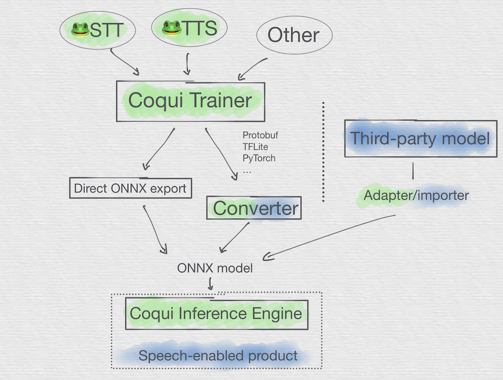
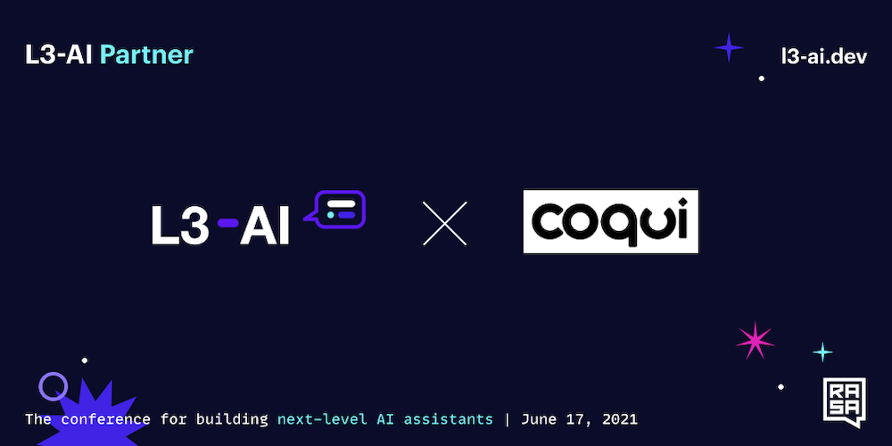

import { graphql } from 'gatsby';

### Welcome

By [Kelly Davis](https://github.com/kdavis-coqui)

🐸TTS was on 🔥 this month bringing lots of improvements and updates your way. First, we’ve
completely re-written the [TTS documentation](https://tts.readthedocs.io). Now it’s easier
than ever to start your TTS journey with the trusted guide of our new 🐸TTS documentation
by your side. Next, we introduced a new [Trainer API](https://tts.readthedocs.io/en/latest/main_classes/trainer_api.html)
which is a lightweight, extensible, and feature-complete training framework for _all_ the
🐸TTS models. If that wasn’t enough, we introduced a new char-to-phoneme model
[Gruut](https://github.com/rhasspy/gruut) that makes 🐸TTS even more realistic.

🐸STT wasn’t sleeping either. Over the last month work began on a complete rewrite of
🐸STT’s "native client", a native library written in C++ focused solely on inference.
In this rewrite we wanted to retain the performance, simplicity, ease-of-use, and
availability of the current "native client", but set a path towards a new, unified
[ONNX](https://onnx.ai) based "native client" that works for both 🐸STT _and_ 🐸TTS.
Though it’s early days for the new "native client", we’ve released an
[initial version](https://github.com/coqui-ai/inference-engine) so you can kick the
tires, drive it around the block, and give us some feedback.

Last but not least, Coqui gave a talk at
[L3-AI: the conference for building next-level AI assistants](https://l3-ai.dev/).
The slides are available [here](https://docs.google.com/presentation/d/e/2PACX-1vQXtFe__a6P-r3lanv2CpZ0NzQzHDu_1E8uUhTaidnT-WtuPHPkKpiZsgc0gY4PmAZQ5d5CMw9fXAf9/pub?start=false&loop=false&delayms=3000);
the video + audio will be available soon.

Enjoy the newsletter!

### 🐸TTS v0.1.0 is out

By [Eren Gölge](https://github.com/erogol)

A ton of updates and improvements are in the new v0.1.0 version of 🐸TTS. Below we cover some of
the important ones, and you can find more info in our [release notes](https://github.com/coqui-ai/TTS/releases/tag/v0.1.0).

#### 📝 TTS documentation

We’ve created shinny, new [TTS documentation](https://tts.readthedocs.io) where you can find all
the information you need to train or test your models, implement new models, load new datasets,
and much more.

The new documentation also contains [here](https://tts.readthedocs.io/en/latest/tutorial_for_nervous_beginners.html)
a new, beginner-friendly intro to 🐸TTS. Getting started is easier than ever.

If you see something is missing, let us know! We're dying for feedback.

#### 🚀 Trainer API

We’ve also introduced a new [Trainer API](https://tts.readthedocs.io/en/latest/main_classes/trainer_api.html).
It provides a lightweight, extensible, and feature-complete training framework for all the 🐸TTS
models. It supports mixed precision and multi GPU training right out-of-the-box and requires no
code changes in your model implementation to take advantage of these functionalities.

With this new API, you can either keep your old way of training models on the terminal or use pure
Python to initialize your model and call the trainer. Using only 🐍Python allows you to run an
experiment on a Jupyter Notebook or customize as you like.

#### 🗣️ Gruut based Char-to-Phoneme

v0.1.0 also comes with a new char-to-phoneme interface, based on [Gruut](https://github.com/rhasspy/gruut),
that covers most of the European languages and has a very flexible API.

Gruut currently supports the following languages, and the list is growing constantly:

- Czech (cs or cs-cz)
- German (de or de-de)
- English (en or en-us)
- Spanish (es or es-es)
- Farsi/Persian (fa)
- French (fr or fr-fr)
- Italian (it or it-it)
- Dutch (nl)
- Russian (ru or ru-ru)
- Swedish (sv or sv-se)

We also support Japanese and Chinese through `pypinyin` and `MeCab`.

If you need to target a language that is not listed above, let us know and we can work together to
make it available under 🐸TTS.

👏 Big thanks to [@synesthesiam](https://github.com/synesthesiam) for his library and efforts in
bringing it to 🐸TTS.

### 🔬 Monthly TTS Papers

By [Eren Gölge](https://github.com/erogol)

This month we’ve also read some really interesting TTS papers. A few, which we found to be of
particular interest, are:

- [A Survey on Neural Speech Synthesis](https://arxiv.org/abs/2106.15561) - Not only because
  they cited 🐸TTS and our latest paper but they provide a very comprehensive survey of
  models. Especially useful for people just starting to work in the TTS field.
- [UnivNet: A Neural Vocoder with Multi-Resolution Spectrogram Discriminators for High-Fidelity
  Waveform Generation](https://arxiv.org/abs/2106.07889) - A new GAN based vocoder. As we’re
  quick on the draw, it is already implemented in 🐸TTS!
- [WaveGrad2](https://arxiv.org/abs/2106.09660) - WaveGrad2 proposes an end-to-end TTS model
  built on diffusion probabilistic models. You guessed it, we also have a WaveGrad vocoder
  implementation in 🐸TTS.

👀 See our [TTS-papers](https://github.com/coqui-ai/TTS-papers) list for even more TTS papers!

### Coqui Inference Engine: A Sneak Peek

By [Reuben Morais](https://github.com/reuben)

From the very inception of the 🐸STT project, one of our goals was to build a speech-to-text system
that is easy to integrate and deploy into any product, regardless of the platform or programming
language of choice. 🐸STT was naturally divided between two main components: the training
infrastructure and a lean deployment library meant to be integrated into speech-enabled products.
The training code is built largely in Python using TensorFlow and other ML libraries. The deployment
library, which in STT is called the "native client", is a native library written in C++, focused
solely on inference. It exposes a C API which is then bound to various programming languages.
This architecture enabled us to make STT available universally, directly from your favorite package
manager.

Since then, we've learned a lot about how people use STT, and the technologies used to build machine
learning pipelines have also evolved significantly. One disadvantage of the current architecture
is how fragile the connection between the training infrastructure and the deployment library is:
we've managed to bend the TensorFlow tooling to our will in order to implement efficient model
exports, sometimes leveraging obscure functionality which can be undocumented, unstable, and
sometimes entirely deprecated. This meant that sometimes changing the model architecture would
unearth obscure problems, which required deep knowledge of both STT and TensorFlow internals to fix.

Given these learnings, we at Coqui have been thinking about the future direction of 🐸STT and its
deployment library. We want to keep the performance, simplicity, ease-of-use, and availability of
our libraries, while finding solutions for the problems described above. We also want to draw a
path towards a unified deployment tool that works for both 🐸STT and 🐸TTS, the latter being built
with PyTorch, not TensorFlow. This foundation could then be expanded to work with any speech model.

With all this in mind, we've started working on the next generation of our "native client", the
Coqui Inference Engine. Built as an independent project, rather than as an STT submodule, and based
on [ONNX](https://onnx.ai), a standard interchange format for machine learning models, the Coqui
Inference Engine will be a unified solution for running speech models efficiently. We're starting
with 🐸STT and 🐸TTS, and in the future will support a variety of architectures, reducing the gap
between speech model architecture exploration and efficient deployment.

In the diagram above you can see an overview of how the components connect and how models flow.
First-party components (meaning usually maintained by Coqui) are colored green, third-party
components (community maintained) are colored in blue, and cases where both Coqui and the
community would maintain offerings are colored in both blue and green.

These are the early days for the Coqui Inference Engine, and we want to invite all interested
developers to collaborate on its design and implementation. Check out
[the repository](https://github.com/coqui-ai/inference-engine) for more information and
[join the discussion on Gitter](https://gitter.im/coqui-ai/inference-engine).

### Coqui Appearance at L3-AI

By [Josh Meyer](https://github.com/JRMeyer)

This year Coqui appeared as a featured partner at [L3-AI: the conference for building next-level AI assistants](https://l3-ai.dev/).
Josh Meyer delivered a talk about deploying scalable, neural voice technologies at the enterprise
level. Soon the recordings will be made available to everyone who wasn't able to attend the
conference virtually, so you can watch the talk and lively Q&A session.

You can find our presentation slides [here](https://docs.google.com/presentation/d/e/2PACX-1vQXtFe__a6P-r3lanv2CpZ0NzQzHDu_1E8uUhTaidnT-WtuPHPkKpiZsgc0gY4PmAZQ5d5CMw9fXAf9/pub?start=false&loop=false&delayms=3000),
and listen to us talk about related themes with Rasa on their podcast
[here](https://podcasts.apple.com/us/podcast/open-source-speech-technology/id1533150162?i=1000518100336).
We will keep you posted on when the new L3AI recordings become available.

In addition to our featured presentation, Coqui had the most active company booth at the
conference! We want to thank all of you who showed up and participated in the lively
discussions!

<!-- markdownlint-enable line-length -->

export const pageQuery = graphql`
  query($fileAbsolutePath: String) {
    ...SidebarPageFragment
  }
`;
