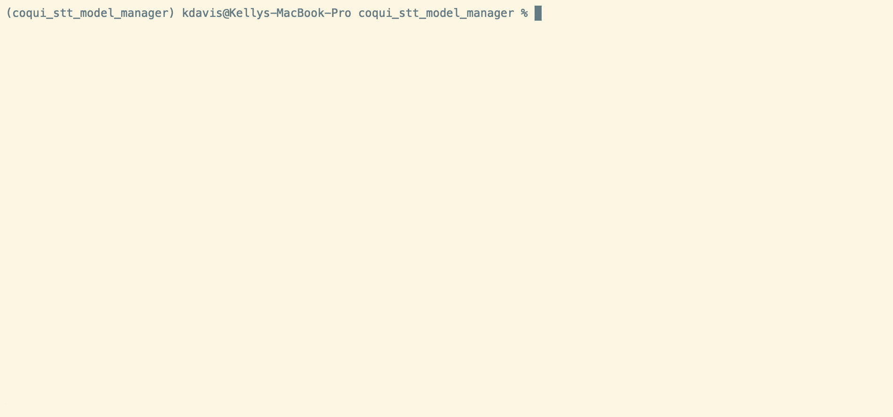
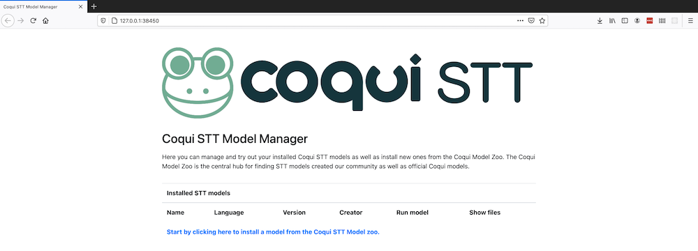

import { graphql } from 'gatsby';

### Welcome

By [Kelly Davis](https://github.com/kdavis-coqui)

Two papers accepted to [INTERSPEECH](https://www.interspeech2021.org/)! For a four person team,
that’s not bad!

We’ve one TTS paper on “SC-GlowTTS”, an efficient zero-shot multi-speaker TTS model that improves
similarity for speakers unseen in training. Check it out [here](https://arxiv.org/abs/2104.05557).
The other paper focuses on STT. It’s titled [Few-Shot Keyword Spotting in Any Language](https://arxiv.org/abs/2104.01454)
and it introduces a few-shot transfer learning method for keyword spotting that works, of course,
in any language.

As we can walk and chew gum at the same time—creating original research and putting it out there
in the world—we also have new models and code for you to dive into.

We’ve created <inlineCode>coqui-stt-model-manager</inlineCode> so you’re only a <inlineCode>pip install</inlineCode>
away from interacting with any one of our STT models, covering 48 languages! Also, we’ve released
a new TTS speaker encoder and a new Japanese TTS model.

For all the details, keep reading 🐸!

### Coqui STT Model Manager

#### As easy as one-two-three

**One:** Install <inlineCode>coqui_stt_model_manager</inlineCode> with <inlineCode>pip</inlineCode>

<code>% pip install coqui_stt_model_manager</code>

**Two:** Start the <inlineCode>stt-model-manager</inlineCode>

<code>% stt-model-manager</code>

**Three:** Your browser is automatically opened to the manager! Enjoy🐸!

#### The Details

If you’re a user of our Coqui 🐸 STT tools, you might know about our broad community of researchers,
developers, and users building and sharing openly licensed STT models for their languages. On the
other hand, you might be unaware about exactly who’s releasing models for which languages, as this
diverse community uses different tools and gathers in different places to discuss.

We’ve been working on ways to aggregate all of this excellent work in a way that highlights it to
everybody else in the community. We want models to be known and used by all interested people, and
we also want to make it easier to connect with creators of models to foster collaboration on open
STT models and the Coqui STT technology in general. The first step in this direction was building
the [Coqui STT Model Zoo](https://coqui.ai/models/), which collects openly licensed models and
presents all the information about each model in a consistent way, making it easier to explore
models and download them. As of today we’re featuring models from 48 different languages!

Now, [we’re happy to release the first version of the Coqui STT Model Manager](https://github.com/coqui-ai/stt-model-manager),
a tool meant to complement the Model Zoo by making it as easy as possible to install, manage, and
try out models locally with your microphone. STT Model Manager integrates into our Model Zoo but
takes care of download and installation automatically. It also provides a quick way to try the
models out for yourself with a single click from the list of installed models. <inlineCode>pip install</inlineCode>
it today!

### Super-Tiny Models

By [Josh Meyer](https://github.com/JRMeyer)

In an effort to push our current code to its limit, we trained our smallest models ever! In a
collaboration with STT community member [Joe Meyer](https://coqui.ai/russian/jemeyer/v0.1.0),
we successfully trained models as small as 320 kilobytes with an accuracy of 98.4%!

These tiny models are practical for low-power hardware which can be significantly smaller than
your average Raspberry Pi. You might find these chipsets in places like smartwatches, smart
speakers, and other IoT devices around the house. Low-power microcomputers must be efficient
in terms of their battery consumption and their memory allocation, and so tiny models are a
great solution.

Leveraging [The Target Words corpus](https://www.youtube.com/watch?v=BTg-PUNi9jw) from project
[Common Voice](https://en.wikipedia.org/wiki/Common_Voice), we trained two models for English:
a yes/no model and a digits recognizer. The former model recognizes two words ("yes" vs. "no")
with an accuracy of 98.4%. The latter model is able to recognize any single digit: "zero", "one",
"two"... up to "nine" with an accuracy of 91.2%. We can easily get these accuracy numbers close
to 100% with larger models, but the real breakthrough is that we are able to train such tiny
models which still are highly accurate. Previously, the smallest models we experimented with
were closer to 40M in size -- these super tiny models are about **125x smaller** than our previous
smallest models!

The approach we took here (just like our tools) can be applied to any language and any words.
If you want to train a model to help you turn on your lightbulbs or make you a double
cappuccino, there's nothing stopping you from starting today! [Join our chat room](https://gitter.im/coqui-ai/STT)
to talk about this and other STT topics!

### 🐸💬 TTS v0.0.15 is out

By [Eren Gölge](https://github.com/erogol)

[v0.0.15](https://github.com/coqui-ai/TTS/releases/tag/v0.0.15) 🐸💬 is out packed with new
features and models. Check out the release notes [here](https://github.com/coqui-ai/TTS/releases/tag/v0.0.15)
for the details, but read on for the highlights!

#### Japanese TTS Model

v0.0.15 🐸💬 contains our first Japanese TTS model. It’s based on [Tacotron2](https://arxiv.org/abs/1712.05884)
with the [Double Decoder Consistency](https://coqui.ai/blog/tts/solving-attention-problems-of-tts-models-with-double-decoder-consistency).
The model uses phonemes as input and generates the final waveform with our universal FullBand [MelGAN](https://arxiv.org/abs/2005.05106)
vocoder. You can try this model using the TTS CLI or server interfaces.

Huge thanks to [@kaiidams](https://github.com/kaiidams) 👋 who contributed this model and
implemented the necessary changes.

#### Speaker Encoder

v0.0.15 🐸💬 also includes a new Speaker Encoder model that is based on [this paper](https://arxiv.org/abs/2009.14153).
While the model is still being trained on a very large dataset, current metrics indicate
promising results over our current speaker encoder. As soon as we finish training, we’ll
make the model available to the community🎊.

<!-- markdownlint-enable line-length -->

export const pageQuery = graphql`
  query($fileAbsolutePath: String) {
    ...SidebarPageFragment
  }
`;
