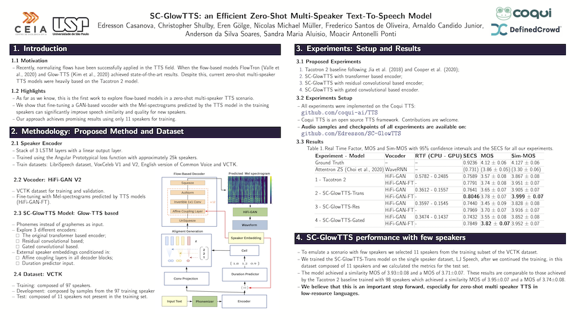
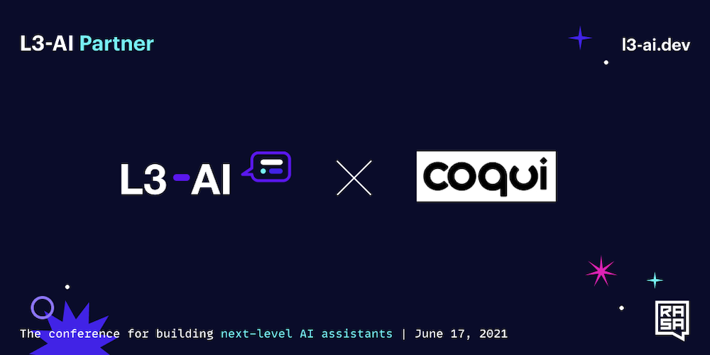

import { graphql } from 'gatsby';


### 👩‍💻Work at Coqui

By [Kelly Davis](https://github.com/kdavis-coqui)

Yeah, you heard that right; we're hiring!

An open source remote-friendly Berlin based startup founded by the creators of Mozilla’s
[text-to-speech](https://github.com/mozilla/tts) (TTS) and [speech-to-text](https://github.com/mozilla/deepspeech)
(STT) engines (over [600K downloads](https://somsubhra.github.io/github-release-stats/?username=mozilla&repository=deepspeech&page=1&per_page=300)
and 23K GitHub stars), with the backing of investors from around the globe (London,
San Francisco, and Berlin), _and_ we're hiring!

What’s not to love?

We’re hiring across-the-board for a number of roles; so, there’s something for everyone:

- [Head of Product](/job/head-of-product)
- 3 x [Senior Full Stack Engineers](/job/senior-full-stack-engineer)
- 2 x [Senior STT Deep Learning Engineers](/job/senior-stt-deep-learning-engineer)
- 2 x [Senior TTS Deep Learning Engineers](/job/senior-tts-deep-learning-engineer)
- 2 x [Senior, Developer Community Managers](/job/senior-developer-community-manager)

The full list of open positions is available on our [jobs page](/jobs).

We’d love to hear from you; so, if any roles pique your interest, reach out to
[jobs@coqui.ai](mailto:jobs@coqui.ai). 🐸!

### 👋🏽Introduction

By [Kelly Davis](https://github.com/kdavis-coqui)

Once again we’re cooking up some speech goodness for you!

Delivered fresh, we’ve [v0.2.1](https://github.com/coqui-ai/TTS/releases), a new
[🐸TTS](https://github.com/coqui-ai/TTS) version for you to dig into. With a new end-to-end
[🐸TTS](https://github.com/coqui-ai/TTS) model and 5 new pre-trained models, one
can synthesize voices from **110 different speakers**. It's chock full of goodness.

Coqui on the inside! Beyond the open source goodness we’re delivering, Coqui’s quietly being
integrated into evermore products. For example, [Galactic Bioware](https://www.galacticbioware.com/),
a protective and smart-wear company, is integrating [🐸STT](https://github.com/coqui-ai/STT)
into their smart firefighter suits. The applications are endless. Also,
[Translators without Borders/CLEAR Global](https://translatorswithoutborders.org/) is using
Swahili [🐸STT](https://github.com/coqui-ai/STT) for chatbots, transcriptions, and telephone
assistance. Nice!

Where there’s a speech conference there’s a Coqui. We just presented
[our latest TTS work](https://www.isca-speech.org/archive/interspeech_2021/casanova21b_interspeech.html)
at Interspeech, _the_ speech conference of the year! Also, the [video](https://www.youtube.com/watch?v=3_U-9p1gzQE)
of our presentation at Rasa’s L3-AI was just released.

Enjoy the newsletter!

### v0.2.1, New 🐸TTS Version Delivered Fresh


By [Eren Gölge](https://github.com/erogol)

This new version introduces a new end-to-end TTS model implementation and 5 pre-trained models.
Check the [release notes](https://github.com/coqui-ai/TTS/releases) for all the details of the
release and [dev plans](https://github.com/coqui-ai/TTS/issues/378) to see what is next.

We added the VITS model to the 🐸TTS model collection. It is the first end-to-end TTS model
implementation added to our library. It directly converts the input text to the waveform without
needing an external vocoder training. For more info about VITS, please see the
[paper](https://arxiv.org/abs/2106.06103) and the
[documentation](https://tts.readthedocs.io/en/latest/models/vits.html).

We are also releasing the following pre-trained models:

- Tacotron2 with Double Decoder Consistency (DDC) trained on the LJSpeech dataset, using phonemes
  as the input. Try it out:

  ```bash
  tts --model_name tts_models/en/ljspeech/tacotronDDC_ph --text "hello, how are you today?"
  ```

- A UnivNet vocoder to work with the model above.
- HifiGAN vocoder trained on Japanese Kokoro dataset (👑[@kaiidams](https://github.com/kaiidams))
  to complement the Japanese Tacotron2 DDC. Try it out:

  ```bash
  tts --model_name tts_models/ja/kokoro/tacotron2-DDC --text "こんにちは、今日はいい天気ですか？"
  ```

- VITS trained on the English LJSpeech dataset. Try it out:

  ```bash
  tts --model_name tts_models/en/ljspeech/vits --text "hello, how are you today?"
  ```

- VITS multi-speaker model trained on the English VCTK dataset. This model can synthesize voices
  from **110 different speakers**. Try it out:

  ```bash
  tts-server --model_name tts_models/en/vctk/vits
  ```

Huge thanks to:

- 👑 Agrin Hilmkil [@agrinh](https://github.com/agrinh)
- 👑 Ayush Chaurasia [@AyushExel](https://github.com/AyushExel)
- 👑 [@fijipants](https://github.com/fijipants)

for their contributions to these versions.

### Coqui on the Inside: Super Suits for Superheroes👩🏻‍🚒


By [Josh Meyer](https://github.com/JRMeyer)

[Galactic Bioware](https://www.galacticbioware.com/), a protective and smart-wear company
based in Australia and the US, is integrating [🐸STT](https://github.com/coqui-ai/STT)
into their future lines of smart firefighter suits. Firefighters wear heavy suits and gloves
in order to protect themselves, but rapid communication is critical. Handheld walkie-talkies
are not ideal, but they’re still widely used. [🐸STT](https://github.com/coqui-ai/STT) is
small enough to live inside the suit itself, which is critical in high-stakes situations where
any delay in communication could cost lives. The firefighter will be able not only to
communicate with their team and back to base, but use voice commands to access information
from the suit’s sensors, such as surrounding temperature and oxygen levels.

### Coqui on the Inside: TWB + Coqui + Swahili = <3


By [Josh Meyer](https://github.com/JRMeyer)

We previously told you about progress being made at
[Translators without Borders/CLEAR Global](https://translatorswithoutborders.org/) (TWB)
for [🐸STT](https://github.com/coqui-ai/STT) and the Bengali language, and we already
have more news!

TWB trained a production-worthy Swahili speech-to-text model (for Congolese Swahili)
using [🐸STT](https://github.com/coqui-ai/STT), and they generously released the model
in [the Coqui Model Zoo](/swahili-congo/twb/v0.3.0). This Swahili model
will help develop use-cases like voice chatbots, machine-assisted transcription, and
telephone IVR to empower humanitarian communication in the Democratic Republic of Congo.

[Alp Öktem](https://alpoktem.github.io/), computational linguist at TWB and co-founder
of [Col·lectivaT](https://collectivat.cat/en), trained the model using only 12 hours of
data, which are also made publicly available from the
[TWB project portal](http://gamayun.translatorswb.org/data/). Keep an eye out for new
models and new voice-enabled applications from TWB!

### Interspeech, _the_ Speech Conference, and We’re There📣


By [Eren Gölge](https://github.com/erogol)

This week 👑 [Edresson Casanova](https://github.com/Edresson) presented one of our
latest works, the SC-Glow multi-speaker TTS, at Interspeech 2021. You can see
the paper [here](https://www.isca-speech.org/archive/interspeech_2021/casanova21b_interspeech.html)
and checkout the poster below. You can already try out the model with 🐸TTS!

Big shout out to all the 🐸 community for making this work possible!! Here's our poster:

[](https://coqui-ai.s3.us-west-2.amazonaws.com/website/interspeech2021_poster.pdf)

### Onward and Upward🚀, Presentation at Rasa’s L3-AI



By [Josh Meyer](https://github.com/JRMeyer)

We made an appearance at the L3-AI conference on conversational AI and in case
you missed it, you can [watch the Coqui presentation video](https://www.youtube.com/watch?v=3_U-9p1gzQE)
online! Listen to our co-founder Josh talk about building modern speech pipelines
for the enterprise that scale to new users, new domains, and new
applications.

This isn’t the first time we’ve chatted with Rasa. If you missed our earlier podcast, we
talk about the lay of the land for open speech technology, and you can
[listen to the podcast](https://open.spotify.com/episode/5KjSoCif3liIExKjTWVtxd) today.

<!-- markdownlint-enable line-length -->

export const pageQuery = graphql`
  query($fileAbsolutePath: String) {
    ...SidebarPageFragment
  }
`;
