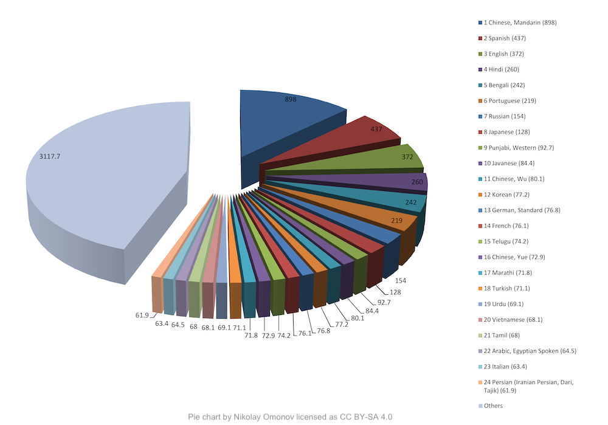

import { graphql } from 'gatsby';

### 👩‍💻Work at Coqui

By [Kelly Davis](https://github.com/kdavis-coqui)

We're still hiring!

An open source remote-friendly Berlin based startup founded by the creators of Mozilla’s
text-to-speech (TTS) and speech-to-text (STT) engines (over 725K downloads and 28K GitHub
stars), with the backing of top-flight investors _and_ we're hiring!

What’s not to love?

We’re hiring across-the-board for a number of roles; so, there’s something for everyone:

- [Head of Product](/job/head-of-product)
- [Senior Full Stack Engineers](/job/senior-full-stack-engineer)
- [Senior STT Deep Learning Engineers](/job/senior-stt-deep-learning-engineer)
- [Senior TTS Deep Learning Engineers](/job/senior-tts-deep-learning-engineer)
- [Senior, Developer Community Managers](/job/senior-developer-community-manager)

The full list of open positions is available on our [jobs page](/jobs).

We’d love to hear from you; so, if any roles pique your interest, reach out to
[jobs@coqui.ai](mailto:jobs@coqui.ai). 🐸!

### Welcome! 👋🐸

By [Kelly Davis](https://github.com/kdavis-coqui)

A new month, a new batch of Coqui goodness!

This month we've a post-game look at our GTC presentation where we talked
about the long tail of languages, how the majority of the world speaks a
"minority" language, and what Coqui's doing about it. Also, we'll go into
some detail on the (secret) special surprise that the lecture launched,
the Long Tail Language Competition!

We'll cover the details of the Long Tail Language Competition: participants
who raised the bar for open speech technology, how much they raised it by,
and the details of a few participants who _really_ stood out.

Not to over rotate on STT, we'll also cover our first TTS Community Meeting,
or TTS Community Meeting v0.5 as it's affectionately come to be known. We
had a great turnout, lots of questions, lots of answers, and lots of TTS
goodness.

In this newsletter we'll also cover an extremely useful addition to the STT
repo, super efficient transcription of long recordings. So, if you've been
sleeping on transcribing that 50 thousand hours of speech you have sitting
around on your harddrive. Now’s the time!

Enjoy!

### Coqui at GTC

By [Kelly Davis](https://github.com/kdavis-coqui)

On November 10th Coqui was given the honour of presenting at NVIDIA's GTC
conference in the "[From Speech to Text: How Does AI Understand the Spoken
Word?](https://events.rainfocus.com/widget/nvidia/nvidiagtc/sessioncatalog?search=A31147&search=A31147)"
session.

Our presentation focused on language's long tail.

The world has roughly 7K languages, but there are only a small number of
languages that have over 50 million native speakers. However, there are
a large number of languages with under 50 million native speakers. As of
2011 there were over _3.1 billion_ native speakers of these "long tail
languages". This leads to the seemingly contradictory conclusion that the
majority of the world speaks "minority" languages?!

Intrigued? Here’s the recording of the presentation:

  <iframe
    width="560"
    height="315"
    src="https://www.youtube.com/embed/7S0u9eSR664"
    frameborder="0"
    allow="accelerometer;
        autoplay; encrypted-media; gyroscope; picture-in-picture"
    allowfullscreen
  ></iframe>

Also, at the lecture's end we included a little surprise, the launching of
the _Long Tail Language Competition_!

### Long Tail Language Competition

By [Josh Meyer](https://github.com/JRMeyer)

For one week in November, community members (new and old) put their all into training
[Speech-to-Text](https://github.com/coqui-ai/stt) models for their favorite languages
for the first ever Coqui Long Tail Language Competition. Why "Long Tail"? Because there's
a long tailed distribution of languages in the world without access to modern speech
technologies.

We want to give developers and communities the tools and knowledge to build their own
tech for their own languages. The data came from Mozilla's Common Voice project, and
the competition was sponsored by [OVHcloud](https://www.ovhcloud.com). OVHcloud
generously donated seven days of free NVIDIA V100 GPU time to each participant!

All the participants raised the bar for Open speech technology, but a few really stood
out. The winners went above and beyond, submitting the best Speech-to-Text model for a
language and vocabulary.

- Abraham Jerry Kakooza ([Twitter](https://twitter.com/KakoozaJerry)
  [Makerere AI Lab](https://twitter.com/AIR_lab_MUK)
  [Open Source Community Africa](https://twitter.com/oscafrica))
- Alp Öktem ([Twitter](https://twitter.com/OktemAlp)
  [CLEAR Global](https://twitter.com/CLEARGlobalOrg)
  [Col·lectivaT](https://twitter.com/collectivat))
- Anas Hasni ([Twitter](https://twitter.com/hasnii_anas))
- Dmitry Gaynullin ([Github](https://github.com/GaynullinDima))
- Mohammed Belkacem ([the Kabyle community](https://wiki.mozilla.org/L10n:Teams:kab))
- SefamerveArge
- tensorflowz
- Yurii Paniv ([Twitter](https://twitter.com/robinhad) [Github](https://github.com/robinhad/))

Models were geared for either large vocabulary, i.e. transcription, or small vocabulary,
i.e. command-and-control scenarios. Winning models were trained from scratch or used
transfer-learning to bootstrap from a pre-trained model.

Fun fact: smallest winning model == 138.5 KB!

The competition is officially over, but you can take a look at the leaderboards (at least
one per language) [here](/ovh).

Thanks again to all those who participated!

### 🐸💬 TTS Community Meeting v0.5

By [Eren Gölge](https://github.com/erogol)

Last week we organized 🐸 TTS Community Meeting v0.5. Our first live community event!

Many questions about 🐸TTS were asked and many questions about 🐸TTS were answered.
We discussed anything from techniques for improving TTS models to dealing with
deprecated method calls. Big kudos to everyone who tuned in.

Don’t worry if you missed it. You can watch the live recording below.

  <iframe
    width="560"
    height="315"
    src="https://www.youtube.com/embed/2yup-Eeebq0"
    frameborder="0"
    allow="accelerometer;
        autoplay; encrypted-media; gyroscope; picture-in-picture"
    allowfullscreen
  ></iframe>

We are looking forward to the next one!

In the meantime, feel free to share your comments and feedback and let us know what
you want to see in our next meeting.

### Efficient Transcription of Longer Recordings

By [Reuben Morais](https://github.com/reuben)

The official Coqui STT packages offer best-in-class support for real-time, single-stream,
low-latency speech recognition. They're highly tuned for fast start-up, low disk space
and memory utilization, and low-latency transcription results. On the other hand, the
pre-trained models in the Coqui Model Zoo can be useful for a number of tasks which don't
have these performance constraints. One such case is offline transcription of longer
recordings — for example, imagine you have several hour-long recordings of lectures and
you want to generate automated captions.

While one could use the 🐸STT command-line clients to transcribe these longer recordings
directly, a more efficient way to handle such cases is by identifying silent sections in
the recording, splitting it into smaller chunks using these silent sections, and then
transcribing the chunks in parallel. We had a script in the repository for handling
this case for a while now, but since it wasn't properly documented, not many people knew
about it.

On the latest main branch we've cleaned up the code, included it in the training package,
and [documented its usage](https://stt.readthedocs.io/en/latest/Checkpoint-Inference.html).
A typical usage of the script looks like this:

The revamped transcription script (`python -m coqui_stt_training.transcribe`) can recursively
scan directories for audio files and transcribe them using all available CPUs. The
transcription results are saved in JSON format, with one time coded transcription result
for each chunk, making it easier to process the results programmatically.

<!-- markdownlint-enable line-length -->

export const pageQuery = graphql`
  query($fileAbsolutePath: String) {
    ...SidebarPageFragment
  }
`;
