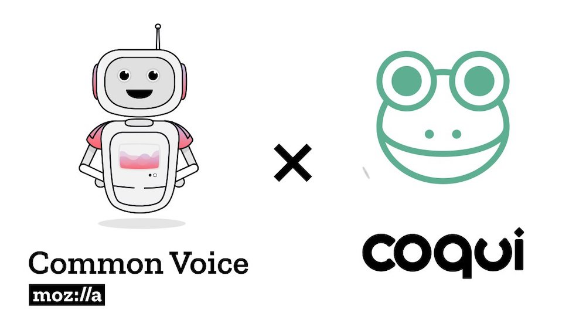
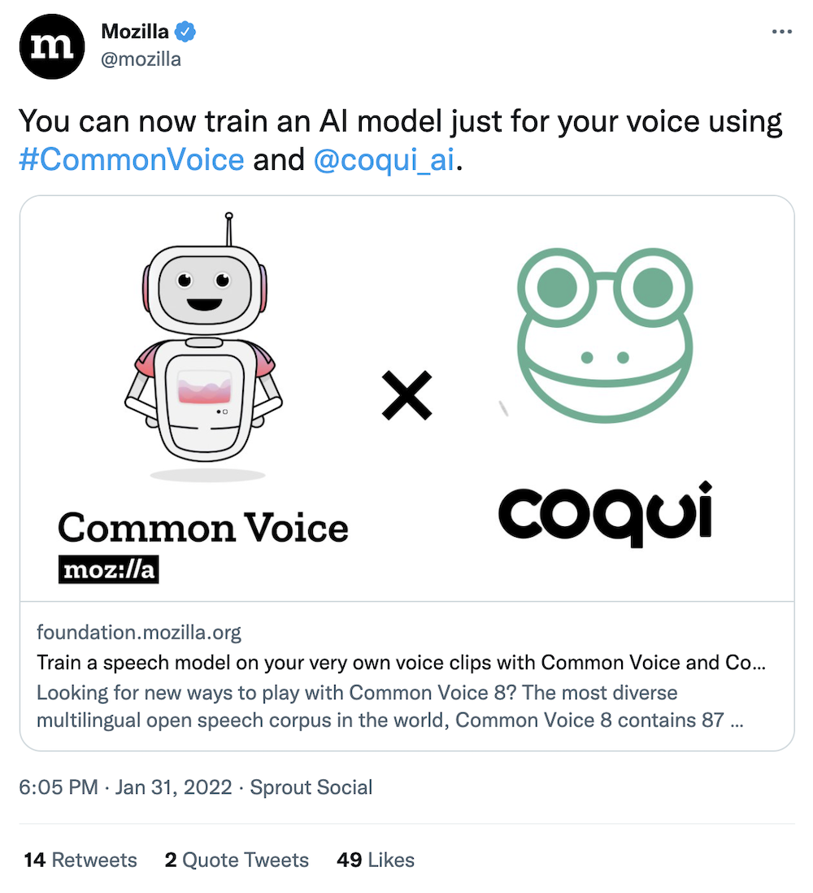
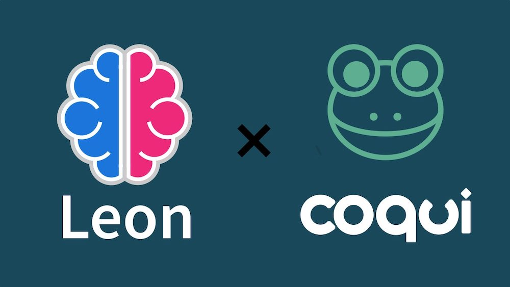

import { graphql } from 'gatsby';

### 👩‍💻Work at Coqui

By [Kelly Davis](https://github.com/kdavis-coqui)

We're still hiring!

An open source remote-friendly Berlin based startup founded by the creators of Mozilla's
text-to-speech (TTS) and speech-to-text (STT) engines (over 800K downloads and 30K GitHub
stars), with the backing of top-flight investors _and_ we're hiring!

What's not to love?

We're hiring across-the-board for a number of roles; so, there's something for everyone:

- [Head of Product](/job/head-of-product)
- [Senior Full Stack Engineers](/job/senior-full-stack-engineer)
- [Senior STT Deep Learning Engineer](/job/senior-stt-deep-learning-engineer)
- [Senior, Developer Community Managers](/job/senior-developer-community-manager)

The full list of open positions is available on our [jobs page](/jobs).

We'd love to hear from you; so, if any roles pique your interest, reach out to
[jobs@coqui.ai](mailto:jobs@coqui.ai). 🐸!

### Hello! 👋🐸

By [Kelly Davis](https://github.com/kdavis-coqui)

I don't know how we pack it all into a month. But, somehow, we do! Coqui's
got lots going on! 🔥🔥🔥

We released a TTS demo, YourTTS, that allows you to clone your voice with
only 20-30 seconds of voice data. If that weren't enough, you don't _only_
get a clone that works in the language you spoke, but the clone works in
any number of other languages too! The demo works for English, Brazilian
Portuguese, and French. Check it out [here](/demo). This newsletter gives
a few details on how the demo went from zero to (number) one on Hacker
News. 🚀🚀🚀

We've also collaborated with our old friends at Common Voice, releasing a
Python notebook that allows individuals to download their own voice data
and fine-tune STT models _for their own voice!_ Holy customization Batman!

As if that weren't enough, Leon, the [most popular](https://github.com/topics/virtual-assistant?o=desc&s=stars)
virtual assistant on GitHub, just added Coqui as its default speech-to-text
provider. 👏🏿👏🏿👏🏿

Not to rest on our laurels, we just pushed STT 1.2.0 out the door! It's
packed with lots of new features: Python 3.10 support, Ogg/Vorbis support,
[WebDataset](https://github.com/webdataset/webdataset) support, and much more!

Also, MozFest. March 7-10, 2022, save the date! We'll be hosting one roundtable
and one hackathon. So, if you've been wanting to hear what we're up to or simply
itching to get your hands dirty with our tech, signup! (Details below the fold!)

One last thing, [spchcat](https://github.com/petewarden/spchcat), `cat` for
speech on Linux, built with Coqui STT 🐸 inside. Read on to find the deatils.

Enjoy the newsletter! 🐸

### Zero to (Number) One (On Hacker News)🔥🔥🔥

By [Kelly Davis](https://github.com/kdavis-coqui)

Boom!🧨🧨🧨

January 3 saw the release of Coqui's YourTTS demo which, in the matter of a few
short hours, went from zero to one on Hacker News! 🚀🚀🚀 (In case you didn't
get a chance to kick the tires on the demo, it's still [here](/demo).
However, it won't be there forever. Get going!)

When we were preparing the demo, we felt it was something special and could, just
possibly, catch on. So, we built the backend to withstand the Hacker News hug of
death. A load balancer (check), auto-scaling group (check), automatic cluster
healing (check). Things seemed ready and prepped for the deathly love hug of
Hacker News.

Through a bit of benchmarking and back-of-the-envelope calculations, we thought
the hug could be survived if we put 26 machines behind the load balancer. (At
the time it seemed overkill, but math is math and doesn't care about your
feelings. So, 26 it was.) As things progressed, 26 looked to be right on target.
Getting onto the front page, climbing the rankings, 30th, 20th, 15th, 10th, 5th,
4th, all smooth sailing! However, as we started to inch towards 3rd, 2nd, and
1st, it was clear we "needed a bigger boat". So, we quickly (It was creeping
towards midnight in Berlin) enlisted the services of 10 more machines to keep
us from sinking. 36 was our magic number!

Thanks for the love Hacker News!

For the curious, the deathly love hug of Hacker News looks like this

A graph of time vs users per minute. As you might have guessed, the peak is when
we hit first place. A little over 2.8K requests per minute, not bad for our
little demo.🔥🔥🔥

If you'd like to learn more about YourTTS, we got you covered. With a
[blog post](/blog/tts/yourtts-zero-shot-text-synthesis-low-resource-languages),
a [project page](https://edresson.github.io/YourTTS/), a
[Colab demo](https://colab.research.google.com/drive/1ftI0x16iqKgiQFgTjTDgRpOM1wC1U-yS?usp=sharing),
and, if you still can't get enough, a [research paper](https://arxiv.org/abs/2112.02418)
with all the details.

### Coqui STT and Common Voice 8.0

By [Josh Meyer](https://github.com/JRMeyer)

You might know that the Coqui origin story begins at Mozilla, where we kicked off
our mission to bring open speech tools to all developers and all languages. But
did you know that we still collaborate with our old friends at Common Voice?
For the latest release of Common Voice 8.0, we cooked up something particularly
fun!

The Common Voice team released a new feature which allows individuals to download
their own voice data. We at Coqui saw this as an opportunity to enable individuals
to create fine-tuned STT models _for their own voice!_

We released an [easy-to-follow Python notebook](https://colab.research.google.com/drive/1-W0T1Scp_940kf4E63CY09MBOeR19kUO)
(runs on Colab) which will take you through all the steps to use Common Voice to
train a custom speech-to-text model just for you.

You can read all about it on [Mozilla's blog](https://foundation.mozilla.org/en/blog/raise-your-voice-training-a-model-on-your-very-own-voice-clips-with-common-voice-and-coqui/)
or just try it out today!

### Coqui now default Speech-to-Text for Leon.ai

By [Josh Meyer](https://github.com/JRMeyer)

Coqui STT is now the default speech-to-text provider for Leon!

[Leon](https://getleon.ai/) is a modern, private-by-design, open-source virtual
assistant. Maintained by [Louis Grenard](https://twitter.com/louistiti_fr), Leon
is the [most popular](https://github.com/topics/virtual-assistant?o=desc&s=stars)
virtual assistant on GitHub!

From [Leon's Github](https://github.com/leon-ai/leon):

- Leon is an open-source personal assistant who can live on your server.
- He does stuff when you ask him.
- You can talk to him and he can talk to you. You can also text him and he can
  also text you. If you want to, Leon can communicate with you by being offline
  to protect your privacy.

The integration was made possible by Johann Barbie, taking advantage of the easy-to-use
[🐸STT JavaScript package](https://www.npmjs.com/package/stt).

### 🐸STT v1.2.0

By [Reuben Morais](https://github.com/reuben)

The latest version of Coqui STT is available on [PyPI](https://pypi.org/project/stt/),
[npm](https://www.npmjs.com/package/stt) and [our release page](https://github.com/coqui-ai/STT/releases/tag/v1.2.0).
It includes new features, usability and performance improvements for the training
and inference, and support for the [Att-HACK expressive speech dataset](https://arxiv.org/abs/2004.04410),
thanks to a contribution by Danny Waser. The highlights are:

- Added Python 3.10 support
- Added new inference APIs that process pending data before returning transcription results
- Added an importer for using data from Common Voice's new personal data downloader, and a
  Jupyter notebook which creates a custom STT model using your data
- Improved and extend `evaluate_tflite` script (now `evaluate_export` module) with Opus support
- Added support for Ogg/Vorbis encoded audio files as training inputs
- Added an importer for the Att-HACK dataset
- Model dimensions are now loaded automatically from a checkpoint if present
- Checkpoint loader will now handle CuDNN checkpoints transparently, without an explicit flag
- When starting a training run, a batch size check will be performed automatically to help
  diagnose memory issues early
- Added support for using [WebDataset](https://github.com/webdataset/webdataset) for streaming
  large training sets from cloud or local storage

[Try Coqui STT today by following our usage guide for your favorite programming language](https://stt.readthedocs.io/).
Our 1.0 English model is compatible with the 1.2 release and has been trained on over
47,000 hours of speech data, including the Common Voice dataset that has over 2,000
hours of speech. It is available for download in the [Coqui Model Zoo](https://coqui.ai/models/),
where we also document the training parameters that were used to create it. You can
also find our latest release in your favorite package manager: we offer packages for
Python, Node.JS, Electron, Java on Android, and C/C++.

### MozFest and the Hackathon

By [Josh Meyer](https://github.com/JRMeyer)

To spread the good word about Coqui, we're teaming up with the Common Voice team at Mozilla
to organize two sessions at this year's MozFest, introducing Coqui STT and TTS to a much
wider developer audience.

[Reserve your (free) tickets now!](https://www.mozillafestival.org/en/tickets)

MozFest is short for "Mozilla Festival". In Mozilla's own words:

> MozFest is a unique hybrid: part art, tech and society convening, part maker festival,
> and the premiere gathering for activists in diverse global movements fighting for a
> more humane digital world.

Coqui and Common Voice are hosting two sessions: one roundtable and one hackathon.

Our roundtable discussion is called **With what words should I speak? Impact of Voice technology
on Language Diversity** and will consist of a diverse and excellent panel of speakers who work
with marginalized languages and technology. This is an exciting and important opportunity to
hear people's experiences speaking languages that Alexa doesn't and to hear how these same
people are working to change the status quo of language technology.

Our hackathon is called is called **Hack the Planet: building real tech for the world's languages**,
and is a sprint to make real, usable tech for languages typically unsupported by big tech. "Real tech"
means that contestants aren't going to be worried about training the model with the best word error
rate on some test set. "Real tech" means taking models and integrating them into a larger project
that is real and usable. This is possible even for STT and TTS models without the highest performance
metrics. We're driving the point home that even for languages without tons of data, you can still
build great voice-enabled software!

Want to participate? [Register for MozFest](https://www.mozillafestival.org/en/tickets) today!

### One Last Thing, Some Love from Linux

By [Josh Meyer](https://github.com/JRMeyer)

We are constantly reminded of how lucky we are to have such an active and open community.
This last month in particular, we saw a new project from one of our community members get
lots of attention!

[Pete Warden](https://twitter.com/petewarden) (head of the TensorFlow team at Google working
on small devices) took the Coqui STT toolkit, and wrapped it up in a project to seamlessly
run on Linux and Raspberry Pi. It's called "spchcat", and it's something like the Unix
"cat" command but for speech.

As Pete says in his
[blogpost](https://petewarden.com/2022/01/06/launching-spchcat-an-open-source-speech-recognition-tool-for-linux-and-raspberry-pi/)
on spchcat:

> I've been following the Coqui.ai team's work since they launched, and was very impressed
> by the quality of the open source speech models and code they have produced. I didn't
> have an easy way to run them myself though, especially on live microphone input. With that
> in mind, I decided my holiday project would be writing a command line tool using Coqui's
> speech to text library.

Coqui STT has been installable on Linux and Raspberry Pi for a while, and we've had the
ability to use microphone input from your browser in the
[stt-model-manager](https://github.com/coqui-ai/stt-model-manager)... so what's new here?

What's new is this: you can now just doble-click on
[Pete's new installer](https://github.com/petewarden/spchcat/releases/download/v0.0.2-alpha/spchcat_0.0-2_amd64.deb),
and run `spchcat` from the terminal, and just start talking into your microphone… it's so simple!

Don't believe us? Believe Pete:

  <iframe
    width="560"
    height="315"
    src="https://www.youtube.com/embed/Z2m8Xg4Ifnk"
    frameborder="0"
    allow="accelerometer;
        autoplay; encrypted-media; gyroscope; picture-in-picture"
    allowfullscreen
  ></iframe>

Check it out for yourself today, and get Coqui STT models right at your fingertips on your favorite Linux machines!

<!-- markdownlint-enable line-length -->

export const pageQuery = graphql`
  query($fileAbsolutePath: String) {
    ...SidebarPageFragment
  }
`;
