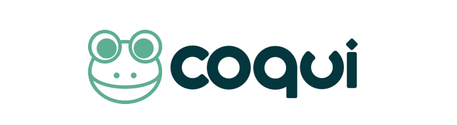
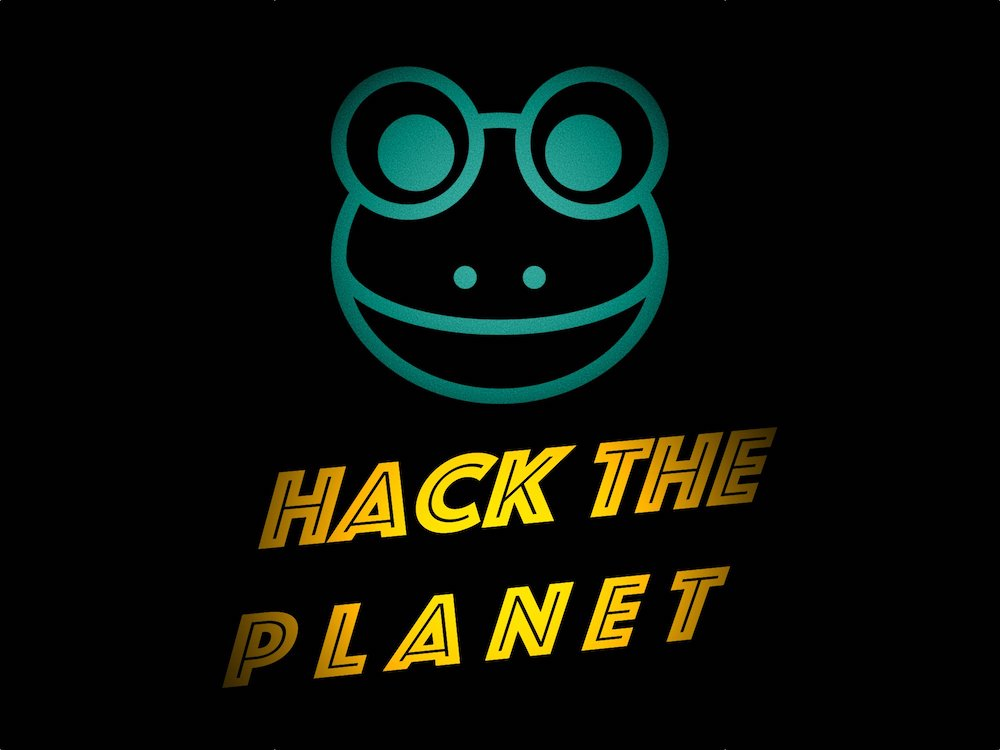

import { graphql } from 'gatsby';



### 👩‍💻Work at Coqui

By [Kelly Davis](https://github.com/kdavis-coqui)

We're hiring!

An open source remote-friendly Berlin based startup founded by the creators of Mozilla's
text-to-speech (TTS) and speech-to-text (STT) engines (over 5M downloads and 30K GitHub
stars), with the backing of top-flight investors _and_ we're hiring!

What's not to love?

We're hiring across-the-board for a number of roles; so, there's something for everyone:

- [Head of Product](/job/head-of-product)
- [Senior Full Stack Engineers](/job/senior-full-stack-engineer)
- [Senior STT Deep Learning Engineer](/job/senior-stt-deep-learning-engineer)
- [Senior, Developer Community Managers](/job/senior-developer-community-manager)

The full list of open positions is available on our [jobs page](/jobs).

We'd love to hear from you; so, if any roles pique your interest, reach out to
[jobs@coqui.ai](mailto:jobs@coqui.ai). 🐸!

### Hello! 👋🐸

By [Kelly Davis](https://github.com/kdavis-coqui)

Hear 👂🏼 the newsletter!

<div align="center">
  <iframe
    width="560"
    height="315"
    scrolling="no"
    frameborder="no"
    allow="autoplay"
    src="https://w.soundcloud.com/player/?url=https%3A//api.soundcloud.com/tracks/1229262295&color=%23ff5500&auto_play=false&hide_related=false&show_comments=true&show_user=true&show_reposts=false&show_teaser=true&visual=true"
  ></iframe>
</div>

Or read 📗 the newsletter!

Hack the Planet🔥🔥🔥 with our new speech-to-text and text-to-speech releases!

On March 8th Coqui and Mozilla are teaming up to Hack the Planet! (Well, at
least part of the planet.) We're flipping the script on machine learning
Hackathons, taking machine learning out of the equation, and catapulting
hackers directly into building real, voice-enabled products. Interested?
[Sign up here](https://schedule.mozillafestival.org/session/JVHV3M-1)!

As we want to make sure your hacking is cutting edge, we're also releasing
a new version of our speech recognition engine, Coqui STT 1.3.0. It includes

- Initial support for Apple Silicon
- Pre-built binaries for iOS/Swift in CI

and tons of other things that aren't Apples🍏.

The new STT release is available on [PyPI](https://pypi.org/project/stt/),
[npmjs](https://www.npmjs.com/package/stt), and we have pre-built binaries
and bindings for C/C++, Java, and iOS/Swift on our
[release page](https://github.com/coqui-ai/STT/releases).

Speech synthesis, not to be out-done, is also releasing a new version,
Coqui TTS 0.6.0. It's overflowing with goodness:

- New Vocabulary, Tokenizer, and Phonemizer APIs
- A general-purpose 👟Trainer
- A new multi-speaker, English YourTTS model with phonemes
- New Turkish and Italian models

and those are just the headlines. The new TTS release is available on
[PyPI](https://pypi.org/project/tts/).

Enjoy the newsletter! 🐸

### &#35;HackThePlanet Hackathon



By [Josh Meyer](https://github.com/JRMeyer)

Mozilla and Coqui are teaming up again to put on a truly unique hackathon.

[Sign up here](https://schedule.mozillafestival.org/session/JVHV3M-1), join a team
on March 8, and get ready to make something awesome!

You might remember our last hackathon in 2021, where determined machine learning
"hackers" competed to train the most accurate speech-to-text models for languages
traditionally under-served by speech technologies.

This time, we're doing things differently.

We're taking all the machine learning out of the equation, and focusing on building
real, voice-enabled products. Hackers will be pulling down pre-trained speech-to-text
and text-to-speech models, and plugging them into new, meaningful products.

You don't have to be an expert in machine learning to create amazing voice-enabled
products…that's the whole point!

Never used speech-to-text or text-to-speech before? ✨This is the perfect opportunity
to get your feet wet! ✨

We can't sit back and wait for Big Tech to make apps for the rest of the world's
languages. Let's Hack the Planet! During this workshop, participants will develop
products of their choice incorporating speech-to-text and text-to-speech for the
languages of their choice, using Coqui's existing voice tech which has been
trained using data from the Common Voice project.

### 🐸TTS v0.6.0


By [Eren Gölge](https://github.com/erogol)

v0.6.0 comes with new models and a ton of updates. Here are some of the most important ones
(Check the [release notes](https://github.com/coqui-ai/TTS/releases/tag/v0.6.0) for all the
details.):

- New Vocabulary, Tokenizer, Phonemizer APIs
  - Now incorporating a new language or an external grapheme-to-phoneme (G2P) solution is
    easier than ever. You just need to inherit from the base classes and implement their
    functions.
- Refactoring of the TTSDataset
  - We split a TTSDataset into TTSDataset, PhonemeDataset, and F0Dataset to better separate
    the concerns and let developers inherit as they need to create new datasets.
- Factoring out the 🐸TTS trainer as a general-purpose 👟[Trainer](https://github.com/coqui-ai/Trainer)
  - 👟Trainer is intended to be a super flexible, succinctly written, and expandable general-purpose
    PyTorch model trainer. We also plan to share it among our other upcoming projects. It is very
    early-stage even though it’s been used in 🐸TTS for a while by now. Let us know what you think!
- Refactoring the VITS model fixing some issues affecting the quality of the previous model
- New multi-speaker, English YourTTS model with phonemes
  - Now you can get way better voice quality (with the fixes in the VITS model) and
    way better pronunciation accuracy (with the use of phonemes instead of graphemes).
- Turkish Glow TTS model and HifiGAN vocoder by 👑 Fatih Akademi
- Italian Glow TTS and VITS models by 👑 [nicolalandro](https://github.com/nicolalandro)
- Updated versions of the earlier models based on the recent API changes

### 🐸STT v1.3.0


By [Reuben Morais](https://github.com/reuben)

STT 1.3.0 comes less than a month after the last stable release, but it is already packed
with lots of improvements. Since the last release we've added improvements to our
training code, our platform support, and added some new pre-built binaries. We have:

- Added initial support for Apple Silicon in our pre-built binaries - C/C++ pre-built
  libraries are universal, language bindings will be updated soon
- Added pre-built binaries for iOS/Swift bindings in CI
  - With these two changes we're hoping to get more feedback from iOS developers on our
    Swift bindings and pre-built STT frameworks - how can we best package and distribute
    the bindings so that it feels native to Swift/iOS developers? If you have any feedback,
    join [our Gitter room](https://gitter.im/coqui-ai/STT)!
- Added new experimental APIs for loading Coqui STT models from memory buffers
  - This allows loading models without writing them to disk first, which can be useful
    for dynamic model loading as well as for handling packaging in mobile platforms
- Added ElectronJS 16 support
- Rewrote audio processing logic in iOS demo app
- Extended the Multilingual LibriSpeech importer to support all languages in the dataset
  - Supported languages: English, German, Dutch, French, Spanish, Italian, Portuguese,
    Polish
- Exposed full metadata information for decoded samples when using the `coqui_stt_ctcdecoder`
  Python package
  - This allows access to the entire information returned by the decoder in training code,
    meaning experimenting with new model architectures doesn't require adapting the C++
    inference library to test your changes.
- Added support for training on FLAC files

And more! In the last month we also started working on adding speaker diarization to the
Coqui STT capabilities. We have our first model up and running internally, and hope to
make it more broadly available soon.

Every Coqui STT release is built in collaboration with our community members who help us
develop, diagnose and triage improvements and fixes to our packages. This month we'd like
to say a special thanks to [Danny Waser](https://github.com/wasertech), who's been doing
lots of work on our dataset importers, and was responsible for extending our Multilingual
LibriSpeech importer to more languages. Thanks Danny!

Our pre-built packages are available on PyPI via

```console
pip install stt
```

and npmjs.com via

```console
npm install stt
```

We also have pre-built binaries and bindings for C/C++, Java, and iOS/Swift in our GitHub
Release page. Install or update your STT integration and
[let us know](https://gitter.im/coqui-ai/STT) how 1.3.0 is doing for you!

<!-- markdownlint-enable line-length -->

export const pageQuery = graphql`
  query($fileAbsolutePath: String) {
    ...SidebarPageFragment
  }
`;
